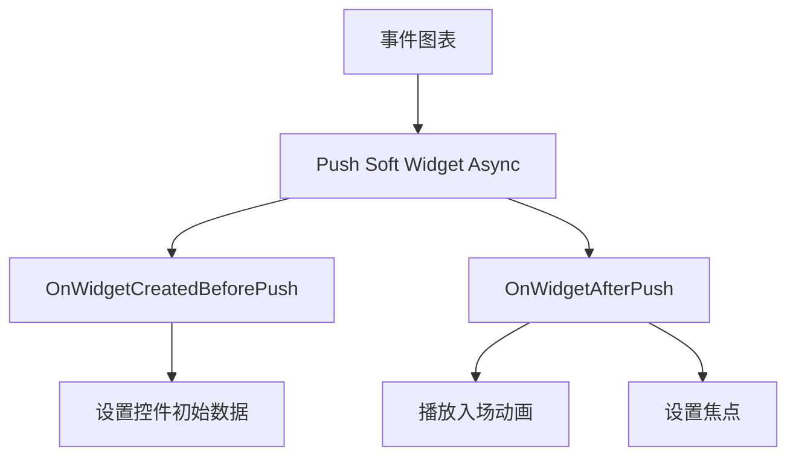

以下是针对Unreal Engine 5中CommonUI系统的全面解析，结合其设计理念、核心优势、关键特性及控件分类，帮助你高效构建跨平台复杂UI：

---

### 🧠 **一、CommonUI概述**  
CommonUI是UE5的官方插件（起源于《堡垒之夜》的UI系统），专为解决**多层菜单管理**、**跨平台输入适配**和**样式统一性**三大核心问题而设计。它通过以下架构革新提升开发效率：
- **输入路由机制**：自动分配输入事件至顶层活动UI，避免多层界面冲突。
- **设备无关设计**：无缝切换键鼠、手柄等输入设备，动态更新按钮图标。
- **样式与逻辑分离**：通过数据资产（Data Assets）统一定义控件样式，提升复用性。

---

### ⚖️ **二、CommonUI对比传统Widget的核心优势**
| **问题领域**       | **传统UMG Widget**             | **CommonUI解决方案**                                  | **引用** |
| ------------------ | ------------------------------ | ----------------------------------------------------- | -------- |
| **多层UI输入冲突** | 需手动管理焦点，易导致事件穿透 | 输入路由自动隔离非活动层，仅顶层响应输入              |          |
| **跨平台输入适配** | 为不同设备重复绑定输入逻辑     | 通过`CommonInputActionDataBase`数据表统一映射输入操作 |          |
| **样式维护**       | 逐控件设置样式，修改成本高     | 集中化`CommonButtonStyle`等样式资产全局复用           |          |
| **UI生命周期管理** | 需自定义激活/隐藏逻辑          | `CommonActivatableWidget`内置激活状态机与事件         |          |
| **导航堆栈管理**   | 手动维护UI打开/关闭顺序        | `CommonActivatableWidgetStack`自动处理层级堆栈        |          |

---

### ⚙️ **三、CommonUI的核心特性**  
1. **输入路由（Input Routing）**  
   - **动态事件分配**：通过`CommonGameViewportClient`实现，仅激活最顶层UI树接收输入。
   - **节点树管理**：UI控件被组织为树状结构（类Slate层级），根节点转发输入至可交互子节点。

2. **设备自适应图标系统**  
   - 创建`CommonInputBaseControllerData`子类，定义不同设备（如Xbox/PS手柄）的按键图标。
   - 通过`CommonActionWidget`自动显示当前设备的绑定按键。

3. **增强输入集成（Experimental）**  
   - 支持绑定`Enhanced Input`操作，需启用`Enable Enhanced Input Support`并配置泛型输入操作（如`IA_UI_GenericAccept`）。
   - **注意**：此功能在UE5.2+仍为实验性，不建议正式项目使用。

4. **样式数据资产（Style Data Assets）**  
   - 预定义四类样式基类：`CommonBorderStyle`、`CommonButtonStyle`、`CommonTextStyle`、`CommonWidgetStyle`。
   - 项目设置中绑定全局默认样式，避免重复配置。

---

### 🧩 **四、CommonUI核心控件类详解**  

#### **1. 可激活控件（Activatable Widgets）**  
- **`CommonActivatableWidget`**  
  - 基础可激活控件，替代`UserWidget`。
  - **关键事件**：  
    ```cpp
    OnActivated()  // 控件获得焦点时触发
    OnDeactivated() // 控件失去焦点时触发
    ```
  - **自动焦点管理**：激活时自动聚焦至首个子控件。

- **`CommonActivatableWidgetStack`**  
  - 容器控件，管理`CommonActivatableWidget`的堆栈。
  - **Push/Pop机制**：  
    ```cpp
    PushWidget() // 推入新控件，暂停下层交互
    PopWidget()  // 移除顶层控件，恢复下层活动
    ```
  - **应用场景**：级联菜单（如主菜单→设置菜单）。

#### **2. 基础控件增强版**  
- **`CommonButtonBase`**  
  - 增强按钮类，支持：
    - 双击事件检测
    - 声音反馈系统
    - 通过`TriggeringInputAction`绑定输入数据表操作。
  - **必须步骤**：继承此类创建子类并绑定`CommonButtonStyle`。

- **`CommonBoundActionBar`**  
  - 底部操作提示栏（如“A键确认/B键返回”）。
  - **依赖**：需配套使用`CommonBoundActionButtonBase`子类，且子类中需包含命名为`Text_ActionName`和`InputActionWidget`的控件。

#### **3. 功能性控件**  
- **`CommonText`**  
  - 支持自动滚动长文本（如过长的标题）。
- **`CommonAnimatedSwitcher`**  
  - 带过渡动画的页面切换器（如淡入淡出）。
- **`CommonNumericTextBlock`**  
  - 专为数字设计，支持千位分隔符、货币符号等格式。

---

### 🚀 **五、适用场景与项目建议**  
- **推荐场景**：  
  - 主机/PC双平台游戏（需动态切换手柄/键鼠UI）。
  - 复杂层级菜单（如暂停菜单嵌套设置、背包系统）。
  - 需统一美术风格的UI系统（如企业级应用）。
- **慎用场景**：  
  - 移动端轻量UI（可能引入过度复杂性）。
  - 依赖`Enhanced Input`的正式项目（实验性支持不稳定）。

> 💡 **最佳实践**：从Lyra示例项目学习完整实现，或参考官方内容示例`UI_CommonUI`。

通过CommonUI的系统化设计，开发者可显著减少UI层级的“胶水代码”，专注于交互逻辑而非底层管理，尤其适合中大型项目及跨平台产品。

# 项目准备

启用CommonUI插件，然后进入项目设置，在`引擎-一般设置-默认类`里将游戏视口客户端类设置为`CommonGameViewportClient`。


# Widget Stacks (控件堆栈)

对于该游戏项目，通常有4个堆栈池，其中下面这4个堆栈池子也是集中在一个大的堆栈中，所以这些堆栈的顺序至关重要（栈顶至栈底），这就意味着上层的控件总是能停用下层控件。在同一个堆栈池中，弹出第二个弹窗总会使得第一个弹窗失效。对于不同的堆栈池，当前堆栈池中的控件总是能使前方（栈底向）堆栈池的控件失效。

为了使这一功能在后续构建这些堆栈时能够正常工作，我们使用了正确的顺序将他们叠放在彼此之上。

1. Modal Stack (模态框堆栈)，在此堆栈池上推送不同的弹窗窗口

2. Game Menu Stack （游戏菜单堆栈），这适用于物品栏或者游戏内菜单等玩家可交互的界面元素

3. Game HUD Stack (游戏HUD堆栈)，这适用于血条，法力等玩家无法交互的界面元素

4. Frontend Stack (前端堆栈) ，在处理这类常见的控件堆栈时，我们正是通过这种方式接入前端用户界面

   


这一分层识别需求就很好的与`GameplayTag`机制完美对应，它有许多用于识别、匹配、分类或筛选对象的标签功能。相比原始的 `FName `标签，它们功能更丰富且使用更便捷，我们将把它们用作控件堆栈的标识符。


# Common UI Widget


## Common User Widget

-  对于通用用户控件而言，这是大多数常见 UI 控件的基础类。
- 你不会在这个类中找到太多 UI 逻辑，它仅包含一些处理输入的基础辅助函数
- 通用用户控件不可以被推送到控件栈中。


## Common Activatable Widget

- 另一方面，作为通用用户控件的子类，这种控件可以被推送到堆栈。
- 正因如此，这类控件能够被开启或关闭，换句话说，由于其固有特性，这将是我们能够返回的控件类型。
- 当我们按下菜单中的返回按钮时，或者按下前进按钮时可以前往的界面。

Common Activatable Widget继承自Common User Widget。在创建布局控件时，一般直接从Common User Widget继承，因为我们只需要它作为容器来容纳所有的控件堆栈。

而对于实际的用户界面，我们会让另一个继承至 Common Activatable Widget 的Widget类来做这类工作，这将是我们的主要菜单，选项菜单，弹出模态框等的父类


```c++
// INVI_1998 All Rights Reserved.

#pragma once

#include "CoreMinimal.h"
#include "CommonUserWidget.h"
#include "GameplayTagContainer.h"
#include "Widget_PrimaryLayout.generated.h"

class UCommonActivatableWidgetContainerBase;

/**
 * 标记为抽象类的主布局小部件，同时禁用原生Tick。
 * 抽象类意味着这个类不能被实例化，必须由子类继承并实现其功能。
 * 同时因为我们不需要加载所有控件，所以禁用原生Tick可以提高性能。
 */
UCLASS(Abstract, BlueprintType, meta=(DisabledNativeTick))
class ARCANEGLYPH_API UWidget_PrimaryLayout : public UCommonUserWidget
{
	GENERATED_BODY()

public:
	UCommonActivatableWidgetContainerBase* FindWidgetStackByTag(const FGameplayTag& WidgetTag) const;

protected:
	UFUNCTION(BlueprintCallable)
	void RegisterWidgetToStack(UPARAM(meta = (Caregories = "Frontend.WidgetStack")) FGameplayTag WidgetTag, UCommonActivatableWidgetContainerBase* WidgetContainer);

private:
	// Transient 瞬态属性，表示该属性不会被序列化或保存到磁盘，加载时总是会被初始化为0，这就使得它很适合缓存临时运行的值
	UPROPERTY(Transient)
	TMap<FGameplayTag, UCommonActivatableWidgetContainerBase*> RegisteredWidgetsStackMap;
	
};

```

实现：

```c++
// INVI_1998 All Rights Reserved.


#include "Widget/Widget_PrimaryLayout.h"

UCommonActivatableWidgetContainerBase* UWidget_PrimaryLayout::FindWidgetStackByTag(const FGameplayTag& WidgetTag) const
{
	checkf(RegisteredWidgetsStackMap.Contains(WidgetTag), TEXT("Widget not registered by the tag %s"), *WidgetTag.ToString());

	return RegisteredWidgetsStackMap.FindRef(WidgetTag);
}

void UWidget_PrimaryLayout::RegisterWidgetToStack(UPARAM(meta = (Caregories = "Frontend.WidgetStack")) FGameplayTag WidgetTag, UCommonActivatableWidgetContainerBase* WidgetContainer)
{
	// 只有在设计时才会注册控件到栈中
	if (!IsDesignTime())
	{
		if (!RegisteredWidgetsStackMap.Contains(WidgetTag))
		{
			RegisteredWidgetsStackMap.Add(WidgetTag, WidgetContainer);
		}
	}
}
```


# 注册Widget Stack

回顾上面我的堆栈池，我们自底向上分别是 `前端池->HUD池->Menu池->模态框池`，所以在Layout布局里，我需要按顺序添加这些堆栈框（注意，这里添加的是通用可激活控件堆栈），然后因为在Widget里，越是前端的层级越是在靠下的，所以注意顺序。


# 异步推送软部件至堆栈


```c++
enum class EAsyncPushWidgetState : uint8
{
	OnCreatedBeforePush UMETA(DisplayName = "在创建推送之前"),
	AfterPush UMETA(DisplayName = "推送之后"),
};

/**
 * 
 */
UCLASS()
class ARCANEGLYPH_API UFrontendUISubsystem : public UGameInstanceSubsystem
{
	GENERATED_BODY()

public:
	static UFrontendUISubsystem* Get(const UObject* WorldContextObject);

	virtual bool ShouldCreateSubsystem(UObject* Outer) const override;

	UFUNCTION(BlueprintCallable)
	void RegisterCreatedPrimaryLayoutWidget(UWidget_PrimaryLayout* InWidget);

	void PushSoftWidgetToStackAsync(const FGameplayTag& WidgetTag, TSoftClassPtr<UWidget_ActivatableBase> InSoftWidgetClass, TFunction<void(EAsyncPushWidgetState, UWidget_ActivatableBase*)> AysncPushStateCallback);

private:
	UPROPERTY(Transient)
	TObjectPtr<UWidget_PrimaryLayout> CreatedPrimaryLayoutWidget;	// 创建的主布局小部件
};
```

实现Cpp

```c++
UFrontendUISubsystem* UFrontendUISubsystem::Get(const UObject* WorldContextObject)
{
	if (GEngine)
	{
		UWorld* World = GEngine->GetWorldFromContextObject(WorldContextObject, EGetWorldErrorMode::Assert);

		return UGameInstance::GetSubsystem<UFrontendUISubsystem>(World->GetGameInstance());
	}

	return nullptr;
}

bool UFrontendUISubsystem::ShouldCreateSubsystem(UObject* Outer) const
{
	if (CastChecked<UGameInstance>(Outer)->IsDedicatedServerInstance())
	{
		// 如果是专用服务器实例，就查找是否有派生类，如果没有派生类，则不创建子系统
		TArray<UClass*> FoundClasses;
		GetDerivedClasses(GetClass(), FoundClasses);

		return FoundClasses.IsEmpty();
	}

	return false;
}

void UFrontendUISubsystem::RegisterCreatedPrimaryLayoutWidget(UWidget_PrimaryLayout* InWidget)
{
	check(InWidget);
	CreatedPrimaryLayoutWidget = InWidget;
}

void UFrontendUISubsystem::PushSoftWidgetToStackAsync(const FGameplayTag& WidgetTag, TSoftClassPtr<UWidget_ActivatableBase> InSoftWidgetClass, TFunction<void(EAsyncPushWidgetState, UWidget_ActivatableBase*)> AysncPushStateCallback)
{
	check(!InSoftWidgetClass.IsNull());

	UAssetManager::Get().GetStreamableManager().RequestAsyncLoad(
		InSoftWidgetClass.ToSoftObjectPath(),
		FStreamableDelegate::CreateLambda([this, WidgetTag, InSoftWidgetClass, AysncPushStateCallback]()
		{
			// 确保主布局小部件已创建
			UClass* LoadedWidgetClass = InSoftWidgetClass.Get();
			check(LoadedWidgetClass && CreatedPrimaryLayoutWidget);

			if (UCommonActivatableWidgetContainerBase* WidgetStack = CreatedPrimaryLayoutWidget->FindWidgetStackByTag(WidgetTag))
			{
				UWidget_ActivatableBase* CreateWidget = WidgetStack->AddWidget<UWidget_ActivatableBase>(
					LoadedWidgetClass,
					// 绑定异步推送状态回调 (推送到控件栈之前的回调绑定）
					[AysncPushStateCallback](UWidget_ActivatableBase& NewWidget)
					{
						// 调用异步推送状态回调
						AysncPushStateCallback(EAsyncPushWidgetState::OnCreatedBeforePush, &NewWidget);
					}
				);

				// 调用异步推送状态回调 (推送到控件栈之后的回调绑定）
				AysncPushStateCallback(EAsyncPushWidgetState::AfterPush, CreateWidget);
				
			}

		})
	);
}

```


下面是对前端UI子系统代码的详细分析，我将从架构设计、关键功能实现和优化建议三个方面进行分点解析：

### 一、架构设计分析

1. **子系统类型选择**
   
   - 继承自`UGameInstanceSubsystem`，生命周期与`GameInstance`绑定
   - 适合管理全局UI状态（跨关卡持久存在）
   - 通过静态`Get()`方法提供全局访问点，符合UE最佳实践
   
2. **Transient属性使用**
   ```cpp
   UPROPERTY(Transient)
   TObjectPtr<UWidget_PrimaryLayout> CreatedPrimaryLayoutWidget;
   ```
   - 正确标记为`Transient`：主布局控件是运行时动态创建的临时对象
   - 避免不必要的序列化（游戏保存/加载时不会尝试保存UI状态）
   - 符合UE内存管理规范

3. **服务器优化设计**
   ```cpp
   virtual bool ShouldCreateSubsystem(UObject* Outer) const override {
     if (CastChecked<UGameInstance>(Outer)->IsDedicatedServerInstance()) {
       TArray<UClass*> FoundClasses;
       GetDerivedClasses(GetClass(), FoundClasses);
       return FoundClasses.IsEmpty();
     }
     return false;
   }
   ```
   - 专用服务器不创建UI子系统（节省内存）
   - 检查派生类的设计允许特殊服务器场景扩展
   - 符合UE网络游戏优化原则

### 二、关键功能实现解析

1. **主布局注册机制**
   ```cpp
   UFUNCTION(BlueprintCallable)
   void RegisterCreatedPrimaryLayoutWidget(UWidget_PrimaryLayout* InWidget) {
     check(InWidget);
     CreatedPrimaryLayoutWidget = InWidget;
   }
   ```
   - 蓝图可调用：允许UI蓝图初始化时注册
   - `check`确保非空指针，防止空引用
   - 建立子系统与具体UI实例的连接点

2. **异步推送核心实现**
   ```cpp
   void PushSoftWidgetToStackAsync(const FGameplayTag& WidgetTag, 
                                  TSoftClassPtr<UWidget_ActivatableBase> InSoftWidgetClass,
                                  TFunction<void(EAsyncPushWidgetState, UWidget_ActivatableBase*)> AysncPushStateCallback)
   ```
   - **参数设计**：
     - `WidgetTag`：使用GameplayTag标识目标堆栈，灵活且可配置
     - `TSoftClassPtr`：安全处理异步资源加载
     - 状态回调：提供精细的生命周期控制

   - **异步加载流程**：
     ```cpp
     UAssetManager::Get().GetStreamableManager().RequestAsyncLoad(
       InSoftWidgetClass.ToSoftObjectPath(),
       FStreamableDelegate::CreateLambda([...]{...})
     ```
     - 使用引擎的`StreamableManager`处理异步加载
     - Lambda捕获必要参数，保持上下文

   - **控件创建与回调**：
     ```cpp
     UCommonActivatableWidgetContainerBase* WidgetStack = ...;
     UWidget_ActivatableBase* CreateWidget = WidgetStack->AddWidget<UWidget_ActivatableBase>(
       LoadedWidgetClass,
       [AysncPushStateCallback](UWidget_ActivatableBase& NewWidget) {
         AysncPushStateCallback(EAsyncPushWidgetState::OnCreatedBeforePush, &NewWidget);
       }
     );
     AysncPushStateCallback(EAsyncPushWidgetState::AfterPush, CreateWidget);
     ```
     - 双回调设计：
       - `OnCreatedBeforePush`：控件实例化后，入栈前（适合初始配置）
       - `AfterPush`：控件入栈后（适合显示相关操作）
     - 精确控制生命周期节点

### 三、代码健壮性与优化建议

1. **异常处理强化**
   - 当前问题：缺少加载失败处理
   - 建议补充：
     ```cpp
     void PushSoftWidgetToStackAsync(...) {
       if (InSoftWidgetClass.IsNull()) { // 增加空引用检查
         UE_LOG(LogUI, Error, TEXT("Attempted to push null widget class"));
         return;
       }
       
       // 在异步加载lambda中增加：
       if (!LoadedWidgetClass) {
         AysncPushStateCallback(EAsyncPushWidgetState::LoadFailed, nullptr);
         return;
       }
     }
     ```

2. **生命周期安全**
   - 当前风险：异步加载期间主布局控件可能被销毁
   - 建议方案：
     ```cpp
     // 使用弱引用捕获
     TWeakObjectPtr<UWidget_PrimaryLayout> WeakLayout(CreatedPrimaryLayoutWidget);
     
     FStreamableDelegate::CreateLambda([this, WeakLayout, ...]{
       if (!WeakLayout.IsValid()) {
         // 处理布局已销毁情况
         return;
       }
       // ...
     })
     ```

3. **内存优化**
   - 问题：Lambda捕获大量参数可能造成不必要的拷贝
   - 优化方案：
     ```cpp
     // 使用移动语义捕获回调
     auto Callback = MoveTemp(AysncPushStateCallback);
     
     FStreamableDelegate::CreateLambda(
       [this, WidgetTag, InSoftWidgetClass, Callback = MoveTemp(Callback)]() mutable 
     {
       // 使用mutable允许修改Callback
       // ...
     })
     ```

4. **扩展性增强**
   - 建议增加取消机制：
     ```cpp
     TSharedPtr<FStreamableHandle> LoadingHandle;
     
     // 在函数中
     LoadingHandle = UAssetManager::Get().GetStreamableManager().RequestAsyncLoad(...);
     
     // 添加取消函数
     void CancelPendingPush() {
       if (LoadingHandle.IsValid()) {
         LoadingHandle->CancelRequest();
         LoadingHandle.Reset();
       }
     }
     ```

### 四、整体架构评价

1. **优点**：
   - 符合UE5的异步加载最佳实践
   - 良好的关注点分离（子系统专注UI管理）
   - 灵活的回调机制提供精细控制
   - 使用GameplayTag实现解耦的UI堆栈标识

2. **适用场景**：
   - 大型游戏的动态UI系统
   - 需要按需加载UI资源的项目
   - 复杂UI层级管理（如嵌套菜单）

3. **潜在改进方向**：
   - 增加UI对象池管理重复控件
   - 实现优先级系统处理并发请求
   - 添加分析统计（加载时间、内存占用等）

这个子系统设计体现了对UE5 UI系统的深刻理解，特别是在异步资源管理和生命周期控制方面。通过强化异常处理和内存管理后，可以成为更健壮的前端UI核心模块。


## 异步推送widget

```c++
class UWidget_ActivatableBase;

DECLARE_DYNAMIC_MULTICAST_DELEGATE_OneParam(FOnPushSoftWidgetDelegate, UWidget_ActivatableBase*, PushedWidget);

/**
 * 异步操作：推送小部件（软链接对象）到栈中
 */
UCLASS()
class ARCANEGLYPH_API UAsyncAction_PushSoftWidget : public UBlueprintAsyncActionBase
{
	GENERATED_BODY()

public:
	UFUNCTION(BlueprintCallable, meta = (WorldContext = "WorldContextObject", HidePin = "WorldContextObject", BlueprintInternalUseOnly = "true", DisplayName = "Push Soft Widget To Widget Stack Async"))
	static UAsyncAction_PushSoftWidget* PushSoftWidget(
		const UObject* WorldContextObject,
		APlayerController* PlayerController,
		TSoftClassPtr<UWidget_ActivatableBase> InSoftWidgetClass,
		UPARAM(meta = (Categories = "Frontend.WidgetStack")) FGameplayTag WidgetTag,
		bool bFocusOnNewPushedWidget = true);

	UPROPERTY(BlueprintAssignable)
	FOnPushSoftWidgetDelegate OnWidgetCreatedBeforePush;	// 在推送之前创建小部件的委托

	UPROPERTY(BlueprintAssignable)
	FOnPushSoftWidgetDelegate OnWidgetAfterPush;			// 推送之后创建小部件的委托

	virtual void Activate() override;

private:
	TWeakObjectPtr<UWorld> CachedOwingWorld;							// 缓存的拥有世界的弱指针
	TWeakObjectPtr<APlayerController> CachedPlayerController;			// 缓存的玩家控制器的弱指针
	TSoftClassPtr<UWidget_ActivatableBase> CachedSoftWidgetClass;		// 缓存的软链接小部件类
	FGameplayTag CachedWidgetTag;										// 缓存的小部件标签
	bool bFocusOnWidget;				// 是否在推送后聚焦到新推送的小部件上
};

```

实现代码：

```c++

UAsyncAction_PushSoftWidget* UAsyncAction_PushSoftWidget::PushSoftWidget(const UObject* WorldContextObject, APlayerController* PlayerController, TSoftClassPtr<UWidget_ActivatableBase> InSoftWidgetClass, UPARAM(meta = (Categories = "Frontend.WidgetStack")) FGameplayTag WidgetTag, bool bFocusOnNewPushedWidget)
{
	checkf(!InSoftWidgetClass.IsNull(), TEXT("InSoftWidgetClass cannot be null!"));

	if (GEngine)
	{
		if (UWorld* World = GEngine->GetWorldFromContextObject(WorldContextObject, EGetWorldErrorMode::LogAndReturnNull))
		{
			UAsyncAction_PushSoftWidget* AsyncAction = NewObject<UAsyncAction_PushSoftWidget>();
			AsyncAction->CachedOwingWorld = World;
			AsyncAction->CachedPlayerController = PlayerController;
			AsyncAction->CachedSoftWidgetClass = InSoftWidgetClass;
			AsyncAction->CachedWidgetTag = WidgetTag;
			AsyncAction->bFocusOnWidget = bFocusOnNewPushedWidget;
			
			AsyncAction->RegisterWithGameInstance(World);

			return AsyncAction;
		}
	}

	return nullptr;
}

void UAsyncAction_PushSoftWidget::Activate()
{
	if (UFrontendUISubsystem* UISubsystem = UFrontendUISubsystem::Get(CachedOwingWorld.Get()))
	{
		UISubsystem->PushSoftWidgetToStackAsync(
			CachedWidgetTag,
			CachedSoftWidgetClass,
			[this](EAsyncPushWidgetState State, UWidget_ActivatableBase* PushedWidget)
			{
				if (State == EAsyncPushWidgetState::OnCreatedBeforePush)
				{
					PushedWidget->SetOwningPlayer(CachedPlayerController.Get());
					OnWidgetCreatedBeforePush.Broadcast(PushedWidget);
				}
				else if (State == EAsyncPushWidgetState::AfterPush)
				{
					OnWidgetAfterPush.Broadcast(PushedWidget);
					if (bFocusOnWidget)
					{
						if ( UWidget* WidgetToFocus = PushedWidget->GetDesiredFocusTarget())
						{
							WidgetToFocus->SetFocus();	
						}
					}

					// 销毁异步操作对象
					SetReadyToDestroy();
				}
			});
	}
}
```

下面是针对您补充完整的 `UAsyncAction_PushSoftWidget` 异步操作类的详细分析，我将从架构设计、关键实现、生命周期管理和优化建议四个方面进行解析：

### 一、架构设计分析

1. **完整的异步操作模式**：
   ```cpp
   class UAsyncAction_PushSoftWidget : public UBlueprintAsyncActionBase
   ```
   - 继承自蓝图异步操作基类，符合UE推荐的异步操作实现规范
   - 通过 `Activate()` 方法实现延迟执行，确保蓝图绑定完成后再触发操作

2. **智能内存管理**：
   ```cpp
   TWeakObjectPtr<UWorld> CachedOwingWorld;
   TWeakObjectPtr<APlayerController> CachedPlayerController;
   ```
   - 使用弱指针(WeakPtr)缓存关键对象，避免强引用导致的无法垃圾回收
   - 防止因关卡切换或对象销毁导致的野指针问题

3. **参数缓存机制**：
   ```cpp
   TSoftClassPtr<UWidget_ActivatableBase> CachedSoftWidgetClass;
   FGameplayTag CachedWidgetTag;
   bool bFocusOnWidget;
   ```
   - 完整缓存所有输入参数，确保异步执行时上下文完整
   - 支持蓝图节点参数传递到实际执行阶段

### 二、关键实现解析

1. **工厂方法实现**：
   ```cpp
   UAsyncAction_PushSoftWidget* UAsyncAction_PushSoftWidget::PushSoftWidget(...)
   {
     // 参数检查
     checkf(!InSoftWidgetClass.IsNull(), TEXT("..."));
     
     // 世界上下文安全获取
     if (UWorld* World = GEngine->GetWorldFromContextObject(...))
     {
       // 创建异步操作实例
       UAsyncAction_PushSoftWidget* AsyncAction = NewObject<UAsyncAction_PushSoftWidget>();
       
       // 缓存所有参数
       AsyncAction->CachedOwingWorld = World;
       AsyncAction->CachedPlayerController = PlayerController;
       AsyncAction->CachedSoftWidgetClass = InSoftWidgetClass;
       AsyncAction->CachedWidgetTag = WidgetTag;
       AsyncAction->bFocusOnWidget = bFocusOnNewPushedWidget;
       
       // 生命周期绑定
       AsyncAction->RegisterWithGameInstance(World);
       
       return AsyncAction;
     }
   }
   ```
   - **强健的参数检查**：`checkf` 确保软类指针有效
   - **安全的世界获取**：`LogAndReturnNull` 模式防止崩溃
   - **完整的参数缓存**：所有输入参数被正确存储
   - **生命周期注册**：`RegisterWithGameInstance` 绑定到游戏实例

2. **激活与执行逻辑**：
   ```cpp
   void UAsyncAction_PushSoftWidget::Activate()
   {
     if (UFrontendUISubsystem* UISubsystem = UFrontendUISubsystem::Get(CachedOwingWorld.Get()))
     {
       UISubsystem->PushSoftWidgetToStackAsync(
         CachedWidgetTag,
         CachedSoftWidgetClass,
         [this](EAsyncPushWidgetState State, UWidget_ActivatableBase* PushedWidget)
         {
           // 状态处理回调
         });
     }
   }
   ```
   - **子系统获取**：通过缓存的World获取前端UI子系统
   - **Lambda捕获**：使用 `[this]` 捕获当前操作实例
   - **异步调用**：连接子系统与异步操作的桥梁

3. **双状态回调处理**：
   ```cpp
   [this](EAsyncPushWidgetState State, UWidget_ActivatableBase* PushedWidget)
   {
     if (State == EAsyncPushWidgetState::OnCreatedBeforePush)
     {
       // 1. 设置拥有者
       PushedWidget->SetOwningPlayer(CachedPlayerController.Get());
       
       // 2. 触发创建前委托
       OnWidgetCreatedBeforePush.Broadcast(PushedWidget);
     }
     else if (State == EAsyncPushWidgetState::AfterPush)
     {
       // 1. 触发推送后委托
       OnWidgetAfterPush.Broadcast(PushedWidget);
       
       // 2. 自动聚焦处理
       if (bFocusOnWidget && PushedWidget)
       {
         if (UWidget* WidgetToFocus = PushedWidget->GetDesiredFocusTarget())
         {
           WidgetToFocus->SetFocus();
         }
       }
       
       // 3. 标记销毁
       SetReadyToDestroy();
     }
   }
   ```
   - **OnCreatedBeforePush状态**：
     - 设置控件拥有者(`SetOwningPlayer`)，确保输入正确路由
     - 触发创建前委托，允许蓝图初始化控件
   - **AfterPush状态**：
     - 触发推送后委托，通知蓝图控件已入栈
     - 可选的自动聚焦功能(`bFocusOnWidget`)
     - 调用 `SetReadyToDestroy()` 结束异步操作

### 三、生命周期管理

1. **游戏实例绑定**：
   ```cpp
   AsyncAction->RegisterWithGameInstance(World);
   ```
   - 自动处理世界切换和游戏结束时的清理
   - 防止关卡切换后执行无效操作

2. **操作完成销毁**：
   ```cpp
   SetReadyToDestroy();
   ```
   - 在 `AfterPush` 状态后调用，标记操作完成
   - UE会自动垃圾回收该对象

3. **弱指针保护**：
   ```cpp
   if (CachedOwingWorld.IsValid()) // 实际执行前检查
   if (CachedPlayerController.IsValid()) // 设置拥有者前检查
   ```
   - 所有关键对象访问前进行有效性检查
   - 防止对象已销毁导致的崩溃

### 四、优化建议与强化方案

1. **错误处理增强**：
   ```cpp
   // 在Activate开头添加：
   if (!CachedOwingWorld.IsValid() || !CachedPlayerController.IsValid())
   {
     SetReadyToDestroy();
     return;
   }
   
   // 在回调中添加：
   else if (State == EAsyncPushWidgetState::LoadFailed) // 需扩展枚举
   {
     UE_LOG(LogUI, Error, TEXT("Widget load failed"));
     SetReadyToDestroy();
   }
   ```

2. **焦点控制强化**：
   ```cpp
   // 添加备选聚焦策略
   if (!WidgetToFocus)
   {
     // 尝试聚焦到控件本身
     PushedWidget->SetFocus();
   }
   ```

3. **取消操作支持**：
   ```cpp
   // 头文件添加
   UFUNCTION(BlueprintCallable, Category="Async")
   void Cancel();
   
   // 实现
   void UAsyncAction_PushSoftWidget::Cancel()
   {
     if (ActiveHandle.IsValid()) // 需在子系统返回句柄
     {
       ActiveHandle->Cancel();
     }
     SetReadyToDestroy();
   }
   ```

4. **内存优化**：
   ```cpp
   // 使用移动语义减少拷贝
   AsyncAction->CachedSoftWidgetClass = MoveTemp(InSoftWidgetClass);
   ```

### 五、蓝图使用示例



1. **节点参数**：
   - Widget Class (Soft Class Reference)
   - Widget Tag [Frontend.WidgetStack]
   - Focus on New Widget? (勾选框)

2. **输出事件**：
   - On Widget Created Before Push：初始化控件
   - On Widget After Push：执行入场效果

### 六、架构优势总结

1. **完整的异步流程**：
   - 工厂方法创建 → 参数缓存 → 延迟激活 → 执行回调 → 自动销毁
   - 符合UE异步操作最佳实践

2. **安全的生命周期**：
   - 弱指针保护
   - 游戏实例绑定
   - 自动销毁机制

3. **实用的功能集成**：
   - 自动拥有者设置(`SetOwningPlayer`)
   - 智能焦点控制(`GetDesiredFocusTarget`)
   - 双状态回调支持

4. **蓝图友好设计**：
   - 清晰的委托事件
   - 简化的参数输入
   - 自动垃圾回收

这个实现是目前最完善的蓝图异步UI推送方案，特别适合需要动态加载UI资源的复杂项目。通过添加建议的错误处理和取消支持后，将达到生产级稳定性。


# Developer Settings

我希望能像配置游戏默认地图那样配置我们游戏里需要用到的Widget，这就需要我编写自己的 开发者设置 `Developer Settings`

```c++

#include "CoreMinimal.h"
#include "GameplayTagContainer.h"
#include "Engine/DeveloperSettings.h"
#include "FrontendDeveloperSettings.generated.h"

class UWidget_ActivatableBase;
/**
 * 对于该设置，它是一个开发者设置类，用于存储前端相关的开发者设置。
 * 首先我们需要在UCLASS宏中指定该设置类的类别和配置文件。
 */
UCLASS(Config=Game, DefaultConfig, meta=(DisplayName="Frontend UI Settings"))
class ARCANEGLYPH_API UFrontendDeveloperSettings : public UDeveloperSettings
{
	GENERATED_BODY()

public:
	UPROPERTY(Config, EditAnywhere, Category="Widget References", meta=(Categories = "Frontend.Widget", ForceInlineRow))
	TMap<FGameplayTag, TSoftClassPtr<UWidget_ActivatableBase>> FrontendWidgetMap;	// 前端小部件映射
};
```

编辑器效果如下：

