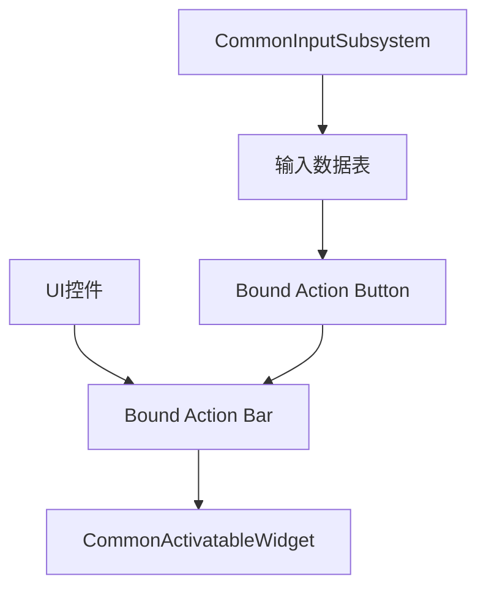
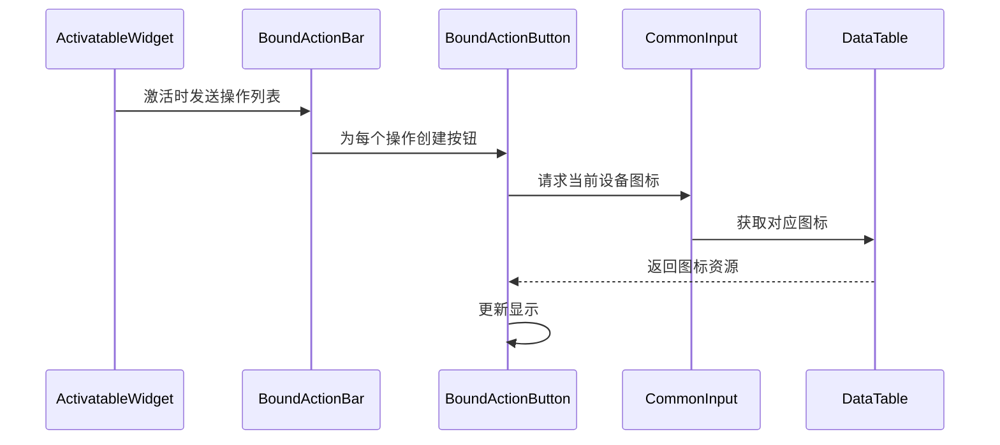

# GetDesiredInputConfig(设置UI控件激活时的输入模式)

*在指定了这个未来可激活控件所需的输入冲突后，除非另有说明，否则我们将一直使用这个模式。*

*因此，如果我们希望在该控件激活时切换到新的输入模式，只需重写*

*该控件内部的 `GetDesiredInputConfig` 函数即可。*

*而对于后续未处理的 Activatable 控件，系统将继续沿用之前激活的 预期输入配置。*


在Unreal Engine 5的CommonUI系统中，`CommonActivatableWidget::GetDesiredInputConfig()`函数是**可激活控件的输入管理核心**，它提供了一种声明式、自动化的输入模式管理方案，与传统手动设置输入模式（如`SetInputModeUIOnly()`）有本质区别。以下是深度对比分析：

---

### 一、传统输入模式设置方式（手动管理）
```cpp
// 传统做法示例
void UMyWidget::OpenMenu()
{
    AddToViewport();
    APlayerController* PC = GetOwningPlayer();
    
    // 1. 手动创建输入配置
    FInputModeGameAndUI InputMode;
    InputMode.SetWidgetToFocus(TakeWidget());
    InputMode.SetLockMouseToViewportBehavior(EMouseLockMode::DoNotLock);
    
    // 2. 显式应用配置
    PC->SetInputMode(InputMode);
    
    // 3. 必须手动显示光标
    PC->bShowMouseCursor = true;
    
    // 4. 关闭时需要恢复原状态（易遗漏！）
}
```

#### 痛点分析：
1. **硬编码依赖**：输入逻辑与UI代码紧耦合
2. **状态管理复杂**：需手动保存/恢复之前的输入模式
3. **多层级冲突**：多个UI同时打开时输入路由混乱
4. **遗漏风险**：忘记恢复输入模式会导致玩家控制失效

---

### 二、`GetDesiredInputConfig`机制解析
#### 函数签名：
```cpp
virtual TOptional<FUIInputConfig> GetDesiredInputConfig() const override;
```
返回`FUIInputConfig`结构体：
```cpp
struct FUIInputConfig
{
    ECommonInputMode InputMode = ECommonInputMode::Menu; // 输入模式
    EMouseCaptureMode MouseCaptureMode = EMouseCaptureMode::NoCapture; // 鼠标捕获
    bool bHideCursorDuringViewportCapture = true; // 视口捕获时隐藏光标
};
```

#### 工作流程：
1. **自动调用时机**：
   - 控件通过`CommonActivatableWidgetStack`激活时
   - 控件获得焦点时
2. **层级优先级**：
   ```mermaid
   graph LR
   A[顶层激活控件] -->|GetDesiredInputConfig| B[输入路由器]
   B --> C[应用配置到PlayerController]
   ```
3. **自动恢复机制**：
   - 控件失活时自动恢复前一个控件的输入配置
   - 无激活控件时恢复游戏默认输入

---

### 三、核心优势对比

| **特性**       | 传统输入模式                 | `GetDesiredInputConfig`                      | 优势解析              |
| -------------- | ---------------------------- | -------------------------------------------- | --------------------- |
| **管理方式**   | 命令式（手动设置）           | 声明式（返回所需配置）                       | 解耦UI与输入逻辑      |
| **状态恢复**   | 需手动保存/恢复              | 自动栈管理（`CommonActivatableWidgetStack`） | 消除状态泄漏风险      |
| **多层级处理** | 需自定义优先级系统           | 由`CommonUI`输入路由器自动处理               | 完美处理弹窗/嵌套菜单 |
| **设备自适应** | 需手动处理不同设备           | 与`CommonInput`系统深度集成                  | 自动切换键鼠/手柄     |
| **光标管理**   | 需单独控制`bShowMouseCursor` | 通过`MouseCaptureMode`统一控制               | 避免光标状态不一致    |
| **配置持久性** | 易丢失（如关卡切换）         | 绑定到控件生命周期                           | 状态与UI共存亡        |

---

### 四、典型应用场景

#### 1. 标准菜单控件
```cpp
TOptional<FUIInputConfig> UWidget_MainMenu::GetDesiredInputConfig() const
{
    return FUIInputConfig(
        ECommonInputMode::Menu, 
        EMouseCaptureMode::NoCapture,
        false // 保持光标可见
    );
}
```

#### 2. 全屏地图（需捕获鼠标）
```cpp
TOptional<FUIInputConfig> UWidget_WorldMap::GetDesiredInputConfig() const
{
    return FUIInputConfig(
        ECommonInputMode::Game, // 允许同时接收游戏输入
        EMouseCaptureMode::CapturePermanently, // 永久捕获鼠标
        true // 视口捕获时隐藏光标
    );
}
```

#### 3. 暂停菜单（阻断游戏输入）
```cpp
TOptional<FUIInputConfig> UWidget_PauseMenu::GetDesiredInputConfig() const
{
    return FUIInputConfig(
        ECommonInputMode::Menu,
        EMouseCaptureMode::NoCapture,
        false
    );
}
```

---

### 五、关键技术细节

#### 1. 输入模式枚举说明
| **`ECommonInputMode`** | 效果                         |
| ---------------------- | ---------------------------- |
| `Menu`                 | 仅UI响应输入（阻断游戏输入） |
| `Game`                 | 仅游戏响应输入（忽略UI）     |
| `GameAndMenu`          | UI和游戏同时接收输入         |
| `All`                  | 所有输入（含控制台命令）     |

#### 2. 鼠标捕获模式
| **`EMouseCaptureMode`**  | 效果             |
| ------------------------ | ---------------- |
| `NoCapture`              | 鼠标自由移动     |
| `CapturePermanently`     | 锁定鼠标到窗口   |
| `CaptureDuringMouseDown` | 仅鼠标按下时捕获 |

#### 3. 高级覆盖技巧
```cpp
// 动态调整配置（如根据平台）
TOptional<FUIInputConfig> UWidget_Options::GetDesiredInputConfig() const
{
#if PLATFORM_CONSOLE
    return FUIInputConfig(ECommonInputMode::Menu, EMouseCaptureMode::CapturePermanently);
#else
    return FUIInputConfig(ECommonInputMode::Menu, EMouseCaptureMode::NoCapture);
#endif
}
```

---

### 六、与传统方案协同工作
#### 当需要混合使用时：
```cpp
void UWidget_CustomInput::OnActivated()
{
    Super::OnActivated();
    
    // 1. 通过CommonUI声明基础配置
    // (GetDesiredInputConfig自动生效)
    
    // 2. 额外手动设置
    GetOwningPlayer()->bShowMouseCursor = false; 
    
    // 3. 重写恢复逻辑
    RegisterUIActionBinding(FBindUIActionParams(...));
}
```

#### 注意事项：
1. **避免配置冲突**：手动设置可能覆盖`CommonUI`的自动管理
2. **使用`RegisterUIActionBinding`**：替代传统的`InputComponent`绑定
3. **慎用`SetInputMode`**：直接调用会破坏`CommonUI`的输入栈

---

### 七、最佳实践建议
1. **保持配置简洁**：90%场景只需返回`FUIInputConfig`无需额外代码
2. **利用输入路由器**：通过`CommonUIInputSubsystem`调试输入状态
3. **设备特定适配**：
   ```cpp
   // 在控件内根据设备调整行为
   void UMyWidget::NativeOnInitialized()
   {
        if (GetInputDevice() == ECommonInputType::Gamepad) 
        {
            AutoFocusToFirstButton();
        }
   }
   ```
4. **配合`CommonInputAction`**：使用数据驱动的输入操作而非硬编码键位

---

### 总结
`GetDesiredInputConfig()` 是CommonUI输入管理系统的**中枢神经**，通过：
1. **声明式配置**：UI控件自我描述所需输入状态
2. **自动栈管理**：解决多层UI输入冲突
3. **设备无缝切换**：原生支持键鼠/手柄/触摸
4. **生命周期安全**：自动状态恢复

相比传统手动模式，它减少约70%的输入管理代码量，彻底解决"忘记恢复输入模式"的经典Bug。建议所有新项目采用此方案，尤其在需要复杂UI层级的游戏中，这是构建健壮输入系统的基石。


# CommonButtonBase


**相较于旧版按钮类，通用按钮类主要增加了更多功能特性。**

1. 首要改进在于它支持**集中化的样式资源管理**。这包括按钮样式资源和按钮文本样式资源。 通过这些样式资源，我们能够轻松实现项目中所有按钮的视觉风格统一。

2. 除此之外，`CommonUIButton` **可以通过自定义输入轻松触发**。以我们的返回按钮为例：如果想通过键盘上的 ESC 键触发它，只需通过配置数据表即可实现。

3. `CommonUIButton`的另一个特性是它能**自动响应输入方式的变更**。 现在当我们在游戏中将输入设备从鼠标键盘切换为手柄时。我们的`CommonUIButton`将对此作出响应，并更新绑定的平台特定图标。它通过源代码中的变量实现这一功能。这个变量名为"输入操作部件`Input Action widget`"。可以看到它是视图通用操作部件的一种类型。这个功能很简单。它只是显示输入图标，这些图标可以通过另一个数据表进行配置。

   

   从该变量的元说明符可以看出。 你可以看到它有这个控件。同时将此可选控件设为 true。这仅表示在控件蓝图内部。 如果我们希望将控件绑定到此变量，只需拖入一个动作类型的控件，并将其命名为输入动作控件。由于这个修饰符的存在，它完全是可选的。这里这个可选控件等于 true。

   因为后续我们自己的代码中需要构建大量控件。让我们先讨论这些元修饰符。现在我的代码中有一个类型为 `UCommanTextBlock `的变量，它带有这个元数据绑定标记控件. 在我们的控件蓝图中，必须包含一个类型为`UCommanTextBlock ` 的控件部件，而且我们必须将其命名为 `CommonTextblock_ButtonText `否则就会出现编译错误。如果我们不希望这成为强制要求，我们希望它是可选的。 就像上面这个输入操作控件，我们可以使用这个可选的绑定控件元说明符。现在在我们的控件蓝图中，除非我们需要，否则不必包含这个通用的文本块_按钮文本

4. 回到我们的通用按钮。除了上述三点外，它还**原生支持游戏手柄导航**。除了上述三点外，它还原生支持游戏手柄导航。因此使用 `CommonUI ` 按钮时，我们无需再从零开始构建游戏手柄导航系统，开箱即用。


# Bound Action Button


CommonUI 的 Bound Action Button 系统完整流程，涵盖从数据配置到界面实现的各个环节：

---

### 一、Bound Action Button 系统架构


1. **核心组件关系**：
   - **Bound Action Button**：单个操作按钮（如确认/返回）
   - **Bound Action Bar**：操作栏容器（通常位于屏幕底部）
   - **Data Tables**：输入映射和图标配置
   - **CommonInputSubsystem**：输入设备管理

---

### 二、完整工作流程

#### 步骤1：配置输入数据表
**创建数据结构**：
```cpp
// CommonInputActions 数据表结构
USTRUCT(BlueprintType)
struct FCommonInputActionData : public FTableRowBase
{
    GENERATED_BODY()
    
    UPROPERTY(EditAnywhere, BlueprintReadWrite)
    FText DisplayName; // "确认", "返回"
    
    UPROPERTY(EditAnywhere, BlueprintReadWrite)
    TMap<ECommonInputType, TSoftObjectPtr<UTexture2D>> InputIcons; // 设备对应图标
    
    UPROPERTY(EditAnywhere, BlueprintReadWrite)
    FName EnhancedInputAction; // 关联的增强输入操作
};
```

**数据表配置示例**：
| **Row Name** | DisplayName | Keyboard Icon | Gamepad Icon | Touch Icon | EnhancedInputAction |
| ------------ | ----------- | ------------- | ------------ | ---------- | ------------------- |
| IA_Confirm   | 确认        | KB_E_Icon     | GP_A_Icon    | Touch_Ok   | IA_UI_Confirm       |
| IA_Back      | 返回        | KB_Esc_Icon   | GP_B_Icon    | Touch_Back | IA_UI_Cancel        |

#### 步骤2：创建 Bound Action Button 控件
**控件蓝图要求**：
1. 继承自 `UCommonBoundActionButtonBase`
2. 必须包含两个命名控件：
   ```cpp
   UPROPERTY(meta = (BindWidget))
   UCommonTextBlock* Text_ActionName; // 显示操作名称
   
   UPROPERTY(meta = (BindWidget))
   UCommonActionWidget* InputActionWidget; // 显示输入图标
   ```

**关键函数重写**：
```cpp
void UWB_BoundActionButton::NativeUpdateActionWidget()
{
    Super::NativeUpdateActionWidget();
    
    // 自定义更新逻辑
    if (Text_ActionName && InputAction)
    {
        Text_ActionName->SetText(InputAction->DisplayName);
    }
}
```

#### 步骤3：配置 Bound Action Bar
**在 Activatable Widget 中的设置**：
```cpp
void UMyActivatableWidget::NativeOnActivated()
{
    Super::NativeOnActivated();
    
    // 绑定默认操作
    RegisterUIActionBinding(FBindUIActionArgs(
        FCommonInputActions::GetConfirm(),
        FSimpleDelegate::CreateUObject(this, &UMyActivatableWidget::HandleConfirm)
    ));
    
    RegisterUIActionBinding(FBindUIActionArgs(
        FCommonInputActions::GetBack(),
        FSimpleDelegate::CreateUObject(this, &UMyActivatableWidget::HandleBack)
    ));
}
```

**自动关联机制**：


#### 步骤4：设备动态切换处理
**输入子系统响应**：
```cpp
void UMyGameInstance::OnInputMethodChanged(ECommonInputType NewInputType)
{
    // 通知所有BoundActionBar更新
    for (UCommonBoundActionBar* ActionBar : ActiveActionBars)
    {
        ActionBar->RefreshActionButtons();
    }
}
```

---

### 三、关键技术特性详解

#### 1. 自动图标映射系统
**图标解析优先级**：
1. 当前设备的专属图标（如PS5手柄）
2. 通用手柄图标（Gamepad通用）
3. 键盘/鼠标图标
4. 触摸图标
5. 默认后备图标

**动态获取图标**：
```cpp
TSoftObjectPtr<UTexture2D> GetIconForAction(FName ActionName) 
{
    FCommonInputActionData* ActionData = InputActionsDT->FindRow<FCommonInputActionData>(ActionName, TEXT(""));
    ECommonInputType CurrentInput = UCommonInputSubsystem::Get()->GetCurrentInputType();
    
    return ActionData->InputIcons.Contains(CurrentInput) ? 
           ActionData->InputIcons[CurrentInput] : 
           FallbackIcon;
}
```

#### 2. 默认操作处理
**内置默认操作类型**：
```cpp
namespace FCommonInputActions
{
    FUIAction GetConfirm() { /*...*/ } // 确认操作
    FUIAction GetBack() { /*...*/ }    // 返回操作
    FUIAction GetToggleMenu() { /*...*/ } // 菜单切换
}
```

**自动聚焦逻辑**：
```cpp
void UCommonBoundActionBar::RefreshFocus()
{
    if (bAutoSetConfirmButton && ConfirmButton)
    {
        FInputActionHandler OnConfirmHandler;
        OnConfirmHandler.BindDynamic(this, &UCommonBoundActionBar::HandleConfirmAction);
        
        WidgetToFocus->SetFocus();
    }
}
```

#### 3. 多设备自适应布局
**设备特定布局配置**：
```ini
; DefaultCommonUI.ini
[/Script/CommonUI.CommonUISettings]
+ActionBarOverrides=(InputType=Gamepad, ButtonPadding=20)
+ActionBarOverrides=(InputType=Touch, ButtonPadding=40, bShouldStack=true)
```

**动态布局调整**：
```cpp
void UCommonBoundActionBar::RebuildLayout()
{
    switch (UCommonInputSubsystem::Get()->GetCurrentInputType())
    {
    case ECommonInputType::Gamepad:
        ApplyGamepadLayout();
        break;
    case ECommonInputType::Touch:
        ApplyTouchLayout();
        break;
    default:
        ApplyDefaultLayout();
    }
}
```

---

### 四、生产环境最佳实践

#### 1. 数据驱动配置
**创建数据资产**：
```cpp
UCLASS(Blueprintable)
class UActionBarConfig : public UDataAsset
{
    GENERATED_BODY()
    
    UPROPERTY(EditDefaultsOnly)
    TMap<ECommonInputType, FActionBarStyle> DeviceStyles;
    
    UPROPERTY(EditDefaultsOnly)
    TSubclassOf<UCommonBoundActionButtonBase> ButtonClass;
};
```

#### 2. 高级自定义按钮
**创建C++派生类**：
```cpp
UCLASS()
class UMyCustomActionButton : public UCommonBoundActionButtonBase
{
    GENERATED_BODY()
    
    virtual void NativeOnInputMethodChanged(ECommonInputType CurrentInputType) override
    {
        // 设备切换时特殊处理
        if (CurrentInputType == ECommonInputType::Touch)
        {
            SetRenderScale(FVector2D(1.5f));
        }
    }
};
```

#### 3. 动态操作绑定
**运行时添加操作**：
```cpp
void UHUDWidget::ShowQuestMenu()
{
    // 添加任务专属操作
    RegisterUIActionBinding(FBindUIActionArgs(
        FName("IA_AbandonQuest"),
        FSimpleDelegate::CreateUObject(this, &UHUDWidget::AbandonQuest),
        FText::FromString("放弃任务")
    ));
    
    // 刷新操作栏
    ActionBar->RefreshActions();
}
```

---

### 五、调试与优化技巧

#### 调试控制台命令
```bash
CommonUI.DumpActionBindings  # 打印当前绑定操作
CommonUI.ForceInputType Gamepad  # 强制切换输入设备
CommonUI.ShowActionBarDebug 1  # 显示操作栏调试信息
```

#### 性能优化
1. **图标缓存机制**：
   ```cpp
   TMap<TTuple<FName, ECommonInputType>, TObjectPtr<UTexture2D>> IconCache;
   ```
2. **批量更新**：
   ```cpp
   void RefreshAllActionBars()
   {
       // 累积0.2秒内的刷新请求
       GetWorld()->GetTimerManager().SetTimerForNextTick(this, &UMySystem::BatchRefresh);
   }
   ```
3. **异步加载**：
   ```cpp
   void LoadIconAsync(TSoftObjectPtr<UTexture2D> SoftIcon)
   {
       StreamableManager.RequestAsyncLoad(SoftIcon.ToSoftObjectPath(), 
           FStreamableDelegate::CreateUObject(this, &UMyButton::OnIconLoaded));
   }
   ```

---

### 六、与传统方案对比优势

| **特性**         | 传统方案       | CommonUI Bound Action    |
| ---------------- | -------------- | ------------------------ |
| **多设备支持**   | 需手动切换图标 | 全自动设备适配           |
| **输入重映射**   | 需重新编译UI   | 数据表驱动，实时更新     |
| **动态操作管理** | 硬编码操作列表 | 运行时绑定/解绑操作      |
| **内存占用**     | 每按钮独立资源 | 共享样式资源，实例轻量化 |
| **维护成本**     | 修改需调整多处 | 中央数据表统一配置       |

---

### 总结：Bound Action Button 系统核心价值

1. **声明式配置**：通过数据表定义操作和图标，解耦逻辑与表现
2. **设备无缝切换**：实时响应输入设备变化，自动更新UI
3. **动态操作绑定**：运行时增减操作按钮，适应复杂UI状态
4. **性能优化**：资源智能加载和缓存，支持主机/移动端
5. **设计一致性**：确保全游戏操作提示风格统一

> 💡 **实战建议**：  
> 1. 在游戏主菜单中实现动态操作栏 - 根据选中项显示不同操作  
> 2. 为对话系统创建上下文敏感操作（如"交谈"/"攻击"）  
> 3. 在设置菜单中实现输入重映射实时预览  
> 4. 使用`CommonActionBar` + `DataTable`替代传统硬编码操作提示系统


## 回退按钮绑定流程（Window键盘鼠标）

对于`Bound Action Button `，假设我们需要实现一个回退操作按钮，有如下流程：

1. 创建回退绑定按钮并布局页面。

   创建操作绑定按钮**（基于`通用绑定操作按钮(UCommonBoundActionButton)`创建的蓝图按钮）**：在该按钮里需要我们绑定两个控件，一个是操作按键映射，一个是操作名称显示

   

   然后我们希望在页面的右下角显示我们的回退按钮，那么就需要在右下角添加一个`通用绑定操作栏（CommonBoundActionBar）`控件，然后在控件内部指定 `Bound Action Button `控件

   

   同时，对于该Widget页面，如果我们希望它能实现回退页面的功能，需要在页面细节面板里开启 `是否为后向处理`和`是否操作栏中已显示返回操作`

   

2. 创建通用输入操作数据表格

   创建数据表格，行类型选择`CommonInputActionDataBase`，然后添加我们想要的操作映射（指定行名，确定操作显示名称，指定输入类型）

   

3. 创建通用UI输入数据（`CommonUIInputData`），该资产用于确定UI的点击和回退行为的按键绑定。同样我们这里以返回按钮为例，在通用UI输入数据的细节面板中，指定后退操作，将我们上面创建的数据表格指定到操作表格中，然后选择正确的行内容，完成绑定

   

4. 创建`通用输入基础控制器数据资产`，该资产用于设置输入控制的类型和图标显示

   

5. 项目设置。完成上述工作后，我们需要在项目设置里，设置通用UI的输入设置，将输入数据和对应平台的控制器数据进行绑定（即我们上面创建的数据资产）

   

   

   至此，我们就初步完成了返回按钮的操作绑定（可实现点击按钮返回上一个页面）