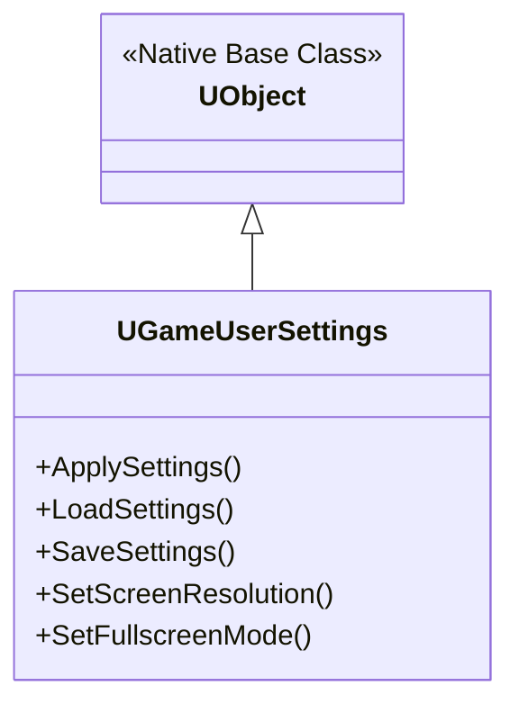

以下是关于 UE5 中 **`UGameUserSettings`** 类的超详细解析，涵盖其核心作用、继承关系、关键功能、常用方法及最佳实践：

---

### 一、核心定位与作用
`UGameUserSettings` 是 **游戏全局设置的管理中枢**，负责处理所有与玩家偏好相关的配置：
1. **图形设置**：分辨率、画质等级、窗口模式、帧率限制
2. **音频设置**：主音量、音效、音乐、语音
3. **游戏性设置**：鼠标灵敏度、键位绑定、游戏难度
4. **存储与加载**：自动保存/加载玩家配置（`GameUserSettings.ini`）
5. **跨会话持久化**：关闭游戏后保留设置

---

### 二、继承关系与关键类


---

### 三、核心功能详解

#### 1. **分辨率与显示控制**
| **方法**                               | **说明**         | **示例**                                       |
| -------------------------------------- | ---------------- | ---------------------------------------------- |
| `SetScreenResolution(FIntPoint)`       | 设置分辨率       | `SetScreenResolution(FIntPoint(1920, 1080))`   |
| `GetScreenResolution()`                | 获取当前分辨率   | `FIntPoint Res = GetScreenResolution()`        |
| `SetFullscreenMode(EWindowMode::Type)` | 窗口模式         | `SetFullscreenMode(EWindowMode::Fullscreen)`   |
| `GetFullscreenMode()`                  | 获取当前窗口模式 | `EWindowMode::Type Mode = GetFullscreenMode()` |
| `SetVSyncEnabled(bool)`                | 垂直同步         | `SetVSyncEnabled(true)`                        |

#### 2. **画质控制**
```cpp
// 设置整体画质等级 (0:Low ~ 3:Epic)
SetOverallScalabilityLevel(2); 

// 单独设置特定画质项
Scalability::SetQualityLevels(
    { 
        .ResolutionQuality = 100,  // 百分比
        .ViewDistanceQuality = 2,  // 0-3
        .AntiAliasingQuality = 1,
        .ShadowQuality = 3,
        .PostProcessQuality = 2,
        .TextureQuality = 1,
        .EffectsQuality = 2 
    }
);
```

#### 3. **音频控制**
```cpp
// 主音量设置 (0.0-1.0)
SetMasterVolume(0.8f); 

// 获取当前音量
float Volume = GetMasterVolume();
```

#### 4. **设置持久化**
| **方法**             | **调用时机** | **说明**       |
| -------------------- | ------------ | -------------- |
| `LoadSettings()`     | 游戏启动时   | 从INI加载配置  |
| `SaveSettings()`     | 修改设置后   | 立即保存到磁盘 |
| `OnStartup()`        | 引擎初始化   | 自动加载设置   |
| `ConfirmVideoMode()` | 分辨率变更后 | 防止无效设置   |

---

### 四、关键方法与工作流

#### 1. **获取全局实例**
```cpp
// 唯一安全的获取方式 (线程安全)
UGameUserSettings* Settings = GEngine->GetGameUserSettings();
```

#### 2. **标准设置修改流程**
```cpp
void UMyGameInstance::ApplyNewSettings()
{
    UGameUserSettings* Settings = GEngine->GetGameUserSettings();
    
    // 1. 修改设置
    Settings->SetScreenResolution(NewResolution);
    Settings->SetFullscreenMode(EWindowMode::WindowedFullscreen);
    Settings->SetVSyncEnabled(bEnableVSync);
    
    // 2. 应用设置 (不保存)
    Settings->ApplySettings(false);
    
    // 3. 显示确认对话框（15秒倒计时）
    Settings->ConfirmVideoMode(); 
    
    // 4. 用户确认后保存
    if(UserClickedConfirm)
    {
        Settings->SaveSettings();
    }
    else // 用户未确认则还原
    {
        Settings->RevertVideoMode();
    }
}
```

#### 3. **自动保存机制**
```cpp
// 修改任何设置时标记为"脏数据"
SetResolutionDirty(); 
SetWindowModeDirty();
SetVSyncDirty();

// 引擎在以下时机自动保存脏数据：
// - 关卡切换
// - 游戏暂停
// - 手动调用 SaveSettings()
```

---

### 五、配置文件解析
设置存储在 `%LOCALAPPDATA%\YourGame\Saved\Config\Windows\GameUserSettings.ini`
```ini
[ScalabilitySettings]
r.ResolutionQuality=100
r.ViewDistanceQuality=2
r.ShadowQuality=3

[/Script/Engine.GameUserSettings]
bUseVSync=True
ResolutionSizeX=1920
ResolutionSizeY=1080
FullscreenMode=1
AudioQualityLevel=0
MasterVolume=0.8
```

---

### 六、高级技巧与陷阱规避

#### 1. **分辨率变更安全策略**
```cpp
// 监听分辨率变更事件
FDisplayMetrics::GetDisplayMetrics(DisplayMetrics);
FDisplayMetrics::OnDisplayMetricsChanged.AddUObject(
    this, 
    &UMyManager::HandleResolutionChange
);

// 处理无效分辨率
void HandleResolutionChange(const FDisplayMetrics& NewMetrics)
{
    if(!IsValidResolution(CurrentRes))
    {
        RevertToSafeResolution(); // 回退到1024x768
    }
}
```

#### 2. **画质设置的动态降级**
```cpp
// 帧率过低时自动降画质
void UMyPerformanceMonitor::CheckFrameRate()
{
    float CurrentFPS = 1 / FApp::GetDeltaTime();
    if(CurrentFPS < 30) 
    {
        Scalability::SetQualityLevels(Scalability::GetQualityLevels() - 1);
    }
}
```

#### 3. **多语言音频设置**
```cpp
// 区分语音与音效
Settings->SetVoiceVolume(0.9f);  // 语音音量
Settings->SetSFXVolume(0.7f);    // 音效音量
Settings->SetDialogueLanguage(ELanguage::Chinese); // 语音语言
```

---

### 七、平台差异处理

| **平台**   | **特殊处理**                                  |
| ---------- | --------------------------------------------- |
| **主机**   | 禁用分辨率设置，锁定垂直同步                  |
| **移动端** | 使用 `SetMobileRenderingQuality()` 替代PC设置 |
| **Switch** | 需处理Dock/手持模式切换                       |
| **VR**     | 额外处理 `SetPixelDensity()` 像素密度         |

---

### 八、最佳实践
1. **永远通过 `GEngine->GetGameUserSettings()` 获取实例**
2. **修改后立即调用 `ApplySettings(false)` 预览效果**
3. **重要变更使用 `ConfirmVideoMode()` 提供回退机制**
4. **移动端使用 `Scalability::FQualityLevels MobileQuality` 专用结构体**
5. **音频修改后调用 `ApplyAudioSettings()` 实时生效**
6. **复杂设置变更时暂停游戏：`UGameplayStatics::SetGamePaused()`**

---

### 九、调试技巧
```cpp
// 控制台命令
r.DebugActionMode 1    // 显示当前画质等级
t.MaxFPS 60            // 覆盖帧率设置
au.DumpSounds           // 输出音频设置

// 日志输出
UE_LOG(LogEngine, Display, TEXT("Current Res: %dx%d"), 
    Settings->GetScreenResolution().X, 
    Settings->GetScreenResolution().Y);
```

掌握 `UGameUserSettings` 能实现专业的设置系统，避免常见的"设置不保存"、"分辨率黑屏"等问题。建议结合 **CommonUI** 构建设置菜单，通过数据驱动实现跨平台适配。