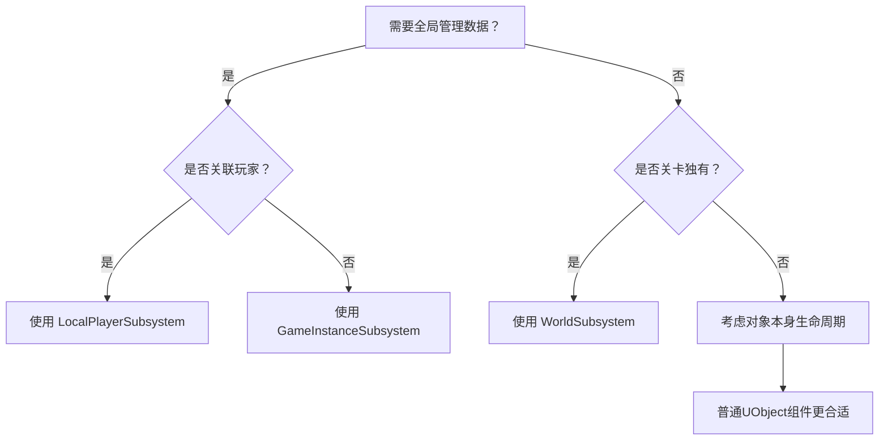

在Unreal Engine 5中，`UGameInstance` 和 `UGameInstanceSubsystem` 都是管理全局游戏状态的核心机制，但它们在设计目标、使用方式和架构定位上有显著差异。以下是详细对比：

---

### 🔧 **一、核心定位与设计目标**
1. **`UGameInstance`**  
   - **全局游戏容器**：作为游戏进程的根对象，贯穿整个游戏生命周期（从启动到关闭），负责管理全局状态、配置和系统级逻辑。  
   - **单例模式**：每个游戏进程仅有一个实例，通过`GetGameInstance()`全局访问。  
   - **功能集中化**：传统上直接承载全局变量和逻辑（如存档管理、网络服务），但易导致代码臃肿。

2. **`UGameInstanceSubsystem`**  
   - **模块化扩展单元**：基于子系统架构，将功能拆分为独立模块（如成就系统、音频管理），依附于`UGameInstance`的生命周期。  
   - **自动生命周期管理**：引擎自动创建/销毁，通过`Initialize()`和`Deinitialize()`钩子控制初始化和清理。  
   - **解耦设计**：避免污染`UGameInstance`，提升代码可维护性和插件兼容性。

---

### ⚙️ **二、生命周期对比**
| **特性**         | `UGameInstance`                     | `UGameInstanceSubsystem`                                     |
| ---------------- | ----------------------------------- | ------------------------------------------------------------ |
| **创建时机**     | 游戏启动时创建                      | `UGameInstance`初始化后自动创建                              |
| **销毁时机**     | 游戏关闭时销毁                      | `UGameInstance`销毁时自动回收                                |
| **初始化顺序**   | 早于关卡加载，晚于引擎启动          | 在`UGameInstance::Init()`中初始化，**早于Actor的`BeginPlay`** |
| **跨关卡持久性** | ✔️ 数据在关卡切换时保留              | ✔️ 同`UGameInstance`                                          |
| **编辑器行为**   | PIE（Play-in-Editor）模式下独立实例 | 随PIE会话创建/销毁，但需注意非即时回收问题                   |

> 例：统计系统若需跨关卡跟踪资源数量，两者皆可存储数据，但`Subsystem`更易隔离功能边界。

---

### 💻 **三、代码实现与访问方式**
1. **`UGameInstance` 用法**  
   - **自定义派生类**：需手动创建子类（如`UMyGameInstance`），并在项目设置中注册。  
   - **变量定义**：直接添加`UPROPERTY`字段，但需谨慎设计避免膨胀：  
     ```cpp
     // MyGameInstance.h
     UCLASS()
     class UMyGameInstance : public UGameInstance {
         GENERATED_BODY()
     public:
         UPROPERTY(BlueprintReadWrite)
         int32 GlobalScore; // 全局分数
     };
     ```
   - **访问方式**：通过任意`UWorld`获取：  
     ```cpp
     UMyGameInstance* GI = GetWorld()->GetGameInstance<UMyGameInstance>();
     ```

2. **`UGameInstanceSubsystem` 用法**  
   - **模块化声明**：继承基类并重写生命周期方法：  
     ```cpp
     // StatsSubsystem.h
     UCLASS()
     class UStatsSubsystem : public UGameInstanceSubsystem {
         GENERATED_BODY()
     public:
         virtual void Initialize(FSubsystemCollectionBase& Collection) override;
         void AddResource(int32 Amount); // 自定义逻辑
     private:
         int32 TotalResources = 0;
     };
     ```
   - **自动实例化**：无需手动注册，引擎自动管理。  
   - **访问方式**（支持蓝图）：  
     ```cpp
     // C++中获取
     UStatsSubsystem* Stats = GetGameInstance()->GetSubsystem<UStatsSubsystem>();
     ```
     ```python
     # 蓝图中通过"Get Game Instance"节点 → "Get Subsystem"调用
     ```

---

### 🏗️ **四、适用场景与优劣分析**
| **场景**              | `UGameInstance` 适用性     | `UGameInstanceSubsystem` 适用性        |
| --------------------- | -------------------------- | -------------------------------------- |
| **小型项目/快速原型** | ✔️ 简单逻辑直接放入         | ⚠️ 过度拆分可能增加复杂度               |
| **大型项目/团队协作** | ⚠️ 易成“上帝对象”难维护     | ✔️ **模块解耦，多人并行开发更高效**     |
| **插件开发**          | ❌ 需修改现有GameInstance类 | ✔️ **插件独立，即插即用**               |
| **蓝图暴露复杂度**    | ⚠️ 需手动管理蓝图可见性     | ✔️ 通过`UFUNCTION`按需暴露              |
| **网络同步**          | ❌ 本身不复制到客户端       | ❌ 同样需依赖`GameState`或`RPC`同步数据 |

> ⚠️ **陷阱提示**  
> - `Subsystem`的`Initialize()`调用极早，**不可访问未初始化的引擎模块**（如加载资源）。  
> - 编辑器模式下，`Subsystem`可能在PIE结束后延迟销毁，需在`Deinitialize()`中主动释放资源。

---

### 🧩 **五、架构演进：为何推荐Subsystem？**
1. **避免继承膨胀**  
   传统`UGameInstance`派生会导致单个类承载过多职责（如同时处理存档、音频、成就），而`Subsystem`按功能切分（例如：  
   - `UAchievementSubsystem`：成就统计  
   - `USaveManagerSubsystem`：存档管理。

2. **动态组合能力**  
   通过`FSubsystemCollection`管理子系统依赖，例如：  
   ```cpp
   // 在子系统中访问其他子系统
   void UStatsSubsystem::Initialize() {
       UAchievementSubsystem* Achievements = GetGameInstance()->GetSubsystem<UAchievementSubsystem>();
       Achievements->BindToResourceEvent(this);
   }
   ```

3. **无缝支持插件化**  
   插件只需包含`Subsystem`类，用户启用插件即自动集成，无需修改`GameInstance`代码。

---

### 💎 **总结：关键选择建议**
- **用 `UGameInstance` 当：**  
  需要少量全局配置（如游戏分辨率），或兼容遗留代码。  
- **用 `UGameInstanceSubsystem` 当：**  
  ✅ 构建复杂全局系统（如经济、任务管理）  
  ✅ 开发可插拔功能模块（如DLC扩展包）  
  ✅ 追求代码整洁性与团队协作效率  

> 二者本质是**组合优于继承**的实践：`UGameInstance`作为容器，`Subsystem`作为模块化组件，协同构建可持续扩展的架构。


在Unreal Engine 5中，获取子系统的代码方式根据场景和子系统类型有所不同，以下是主要方法及其核心区别：

---

### 🔧 **一、标准获取方法（GameInstance子系统）**
#### 1. **通过GameInstance获取（推荐）**
```cpp
// C++ 标准方式
UMySubsystem* Subsystem = GetGameInstance()->GetSubsystem<UMySubsystem>();
```
```python
# 蓝图实现
[Get Game Instance] → [Get Subsystem (MySubsystem Class)]
```
**特点**：  
- **生命周期安全**：仅在`UGameInstance`有效时返回实例  
- **自动创建**：首次调用时若未初始化会自动触发`Initialize()`  
- **跨关卡有效**：与GameInstance生命周期绑定  

---

#### 2. **通过WorldContext获取（兼容性更强）**
```cpp
// 在Actor/Component等有WorldContext的对象中
UMySubsystem* Subsystem = UGameInstance::GetSubsystem<UMySubsystem>(GetWorld());
```
**适用场景**：  
- 无法直接访问`GameInstance`的代码位置  
- 编辑器工具类等特殊环境  

---

### ⚠️ **二、特殊子系统类型的获取方式**
#### 1. **编辑器子系统（`UEditorSubsystem`）**
```cpp
// 仅在编辑器模式下有效
UMyEditorSubsystem* EditorSubsystem = GEditor->GetEditorSubsystem<UMyEditorSubsystem>();
```
**限制**：  
- 仅能在编辑器模块中使用（如`Editor.Cpp`文件）  
- 运行时游戏不可用  

---

#### 2. **本地玩家子系统（`ULocalPlayerSubsystem`）**
```cpp
// 需关联到特定玩家
ULocalPlayer* LocalPlayer = GetLocalPlayer();
UPlayerSettingsSubsystem* PlayerSubsystem = LocalPlayer->GetSubsystem<UPlayerSettingsSubsystem>();
```
**特点**：  
- 数据按玩家隔离（如键位设置、存档）  
- 生命周期绑定到`ULocalPlayer`  

---

### 🚫 **三、禁止使用的危险方式**
```cpp
// 错误示例：直接静态获取（可能导致崩溃！）
UMySubsystem* BadSubsystem = GEngine->GetEngineSubsystem<UMySubsystem>();
```
**风险**：  
- 未考虑子系统是否已初始化  
- 在多World场景（如PIE）中返回错误实例  

---

### 💡 **四、关键使用区别总结**
| **获取方式**                        | 适用子系统类型       | 生命周期安全 | 多World支持 | 典型场景                 |
| ----------------------------------- | -------------------- | ------------ | ----------- | ------------------------ |
| `GetGameInstance()->GetSubsystem()` | GameInstance子系统   | ✅            | ✅           | 游戏运行时全局系统       |
| `GetWorld()->GetSubsystem()` *      | World子系统          | ⚠️            | ✅           | 关卡独有管理（慎用）     |
| `LocalPlayer->GetSubsystem()`       | LocalPlayer子系统    | ✅            | ✅           | 玩家专属数据             |
| `GEditor->GetEditorSubsystem()`     | 编辑器子系统         | ✅            | ❌           | 编辑器工具开发           |
| 静态GetEngineSubsystem()            | 引擎子系统（极少用） | ❌            | ❌           | **不推荐！存在崩溃风险** |

> *注：`GetWorld()->GetSubsystem()` 仅适用于从`UWorldSubsystem`派生的子系统，与GameInstance子系统无关

---

### 🛠️ **五、最佳实践建议**
1. **前置空指针检查**  
   ```cpp
   if (UMySubsystem* Subsystem = GetGameInstance()->GetSubsystem<UMySubsystem>()) {
       Subsystem->DoSomething();
   }
   ```

2. **处理未初始化场景**  
   在`Actor::BeginPlay()`中访问，避免在构造函数中调用（此时子系统可能未创建）

3. **多线程访问防护**  
   ```cpp
   // 在子系统内部处理线程安全
   void UMySubsystem::UpdateData() {
       FScopeLock Lock(&DataMutex); // 使用互斥锁
       // 修改共享数据
   }
   ```

4. **编辑器兼容性处理**  
   ```cpp
   #if WITH_EDITOR
   if (GIsEditor) {
       if (UMyEditorSubsystem* EditorSys = GEditor->GetEditorSubsystem<...>()) 
   }
   #endif
   ```

---

### ⚠️ **六、常见陷阱解决方案**
| **问题现象**          | 原因                                                       | 解决方案                                                |
| --------------------- | ---------------------------------------------------------- | ------------------------------------------------------- |
| 返回nullptr           | 1. 生命周期未开始（如构造函数）<br>2. 未正确继承子系统基类 | 1. 延迟到`BeginPlay`访问<br>2. 检查`UCLASS()`宏是否缺失 |
| 多玩家模式数据混乱    | 错误使用GameInstance子系统存储玩家数据                     | 改用`ULocalPlayerSubsystem`                             |
| PIE模式下获取错误实例 | 未通过`GetWorld()`传递WorldContext                         | 使用`UGameInstance::GetSubsystem(GetWorld())`           |
| 编辑器崩溃            | 在Runtime模块调用EditorSubsystem                           | 添加`#if WITH_EDITOR`宏保护                             |

---

### 💎 **终极选择指南**


> 掌握正确的获取方式可避免90%的子系统相关崩溃，核心原则：**通过合法的WorldContext获取，并始终检查返回值**。


在仅持有 `const UObject* WorldContextObject` 的情况下获取 `ULocalPlayer`，需根据场景选择不同策略。以下是 **5种可靠方法** 及其适用场景：

---

### 🔧 一、核心方法（按优先级推荐）
#### 1. **通过玩家控制器反向获取（最安全）**
```cpp
// 在Actor/Widget等有PlayerController关联的对象中
APlayerController* PC = WorldContextObject->GetWorld()->GetFirstPlayerController();
if (PC) {
    ULocalPlayer* LocalPlayer = Cast<ULocalPlayer>(PC->Player);
    // 使用LocalPlayer获取子系统
    UCommonInputSubsystem* InputSys = LocalPlayer->GetSubsystem<UCommonInputSubsystem>();
}
```
**适用场景**：  
- 当前世界存在玩家控制器（如游戏运行时）

---

#### 2. **通过GameInstance遍历本地玩家（多玩家兼容）**
```cpp
UGameInstance* GameInstance = WorldContextObject->GetWorld()->GetGameInstance();
if (GameInstance) {
    // 获取第一个本地玩家（单玩家模式）
    ULocalPlayer* LocalPlayer = GameInstance->GetFirstGamePlayer();
    
    // 多玩家场景遍历所有本地玩家
    for (ULocalPlayer* LP : GameInstance->GetLocalPlayers()) {
        // 处理每个玩家的子系统
    }
}
```

---

#### 3. **直接解析WorldContext（编辑器友好）**
```cpp
// 适用于工具类代码
UWorld* World = GEngine->GetWorldFromContextObject(WorldContextObject, EGetWorldErrorMode::LogAndReturnNull);
if (World) {
    UGameInstance* GI = World->GetGameInstance();
    ULocalPlayer* LocalPlayer = GI ? GI->GetFirstGamePlayer() : nullptr;
}
```
**优势**：  
- 兼容编辑器工具类（如`FWorldContext`非游戏环境）

---

### ⚠️ 二、特殊场景处理
#### 1. **在静态函数/无WorldContext时**
```cpp
// 使用GEngine获取主世界
UWorld* MainWorld = GEngine->GetCurrentPlayWorld();
if (!MainWorld) MainWorld = GEngine->GetWorldContexts()[0].World(); // 备选

if (MainWorld) {
    APlayerController* PC = MainWorld->GetFirstPlayerController();
    ULocalPlayer* LocalPlayer = PC ? Cast<ULocalPlayer>(PC->Player) : nullptr;
}
```

#### 2. **编辑器工具期间**
```cpp
#if WITH_EDITOR
if (GIsEditor) {
    UEditorEngine* EditorEngine = Cast<UEditorEngine>(GEngine);
    if (EditorEngine) {
        // 获取PIE模式的本地玩家
        ULocalPlayer* EditorPlayer = EditorEngine->GetFirstGamePlayer(WorldContextObject->GetWorld());
    }
}
#endif
```

---

### 💡 三、关键验证与错误处理
```cpp
// 安全的完整流程示例
ULocalPlayer* GetSafeLocalPlayer(const UObject* WorldContext) {
    if (!IsValid(WorldContext)) return nullptr;
    
    // 1. 尝试通过玩家控制器获取
    if (APlayerController* PC = WorldContext->GetWorld()->GetFirstPlayerController()) {
        if (ULocalPlayer* LP = Cast<ULocalPlayer>(PC->Player)) return LP;
    }

    // 2. 回退到GameInstance获取
    if (UGameInstance* GI = WorldContext->GetWorld()->GetGameInstance()) {
        return GI->GetFirstGamePlayer();
    }

    // 3. 终极回退：引擎主世界
    return GEngine->GetLocalPlayerFromWorldContext(WorldContext);
}
```

---

### 🛠️ 四、不同引擎版本的差异处理
| **引擎版本** | **推荐方式**                                                 | 注意事项                      |
| ------------ | ------------------------------------------------------------ | ----------------------------- |
| **UE4.27+**  | `GEngine->GetLocalPlayerFromWorldContext()`                  | 官方推荐，但需验证World有效性 |
| **UE5.0+**   | `UGameplayStatics::GetPlayerController(WorldContext, 0)->GetLocalPlayer()` | 需空指针防护                  |
| **UE5.2+**   | `ULocalPlayer::GetSubsystem<UCommonInputSubsystem>(UWorld*)` | 新增World直接支持             |

> ✨ **UE5.2 简化写法**：  
> ```cpp
> // 5.2新增：直接通过World获取首个本地玩家
> ULocalPlayer* LocalPlayer = WorldContextObject->GetWorld()->GetFirstLocalPlayerFromController();
> ```

---

### ⚠️ 五、常见崩溃场景解决方案
| **问题现象**           | 原因                     | 修复方案                                         |
| ---------------------- | ------------------------ | ------------------------------------------------ |
| 返回`nullptr`          | World未初始化/游戏未开始 | 添加`if(GetWorld()->HasBegunPlay())`判断         |
| 多PIE窗口获取错误玩家  | 未关联正确的WorldContext | 用`GEngine->GetWorldFromContextObjectChecked()`  |
| 编辑器模式下崩溃       | 在非PIE环境调用游戏代码  | 用`#if WITH_EDITOR` + `GIsPlayInEditorWorld`判断 |
| 分屏模式获取主玩家失败 | 未指定玩家索引           | 遍历`GetGameInstance()->GetLocalPlayers()`       |

---

### 💎 终极代码模板
```cpp
ULocalPlayer* GetLocalPlayerSafe(const UObject* WorldContext, int32 PlayerIndex = 0) {
    UWorld* World = GEngine->GetWorldFromContextObject(WorldContext, EGetWorldErrorMode::ReturnNull);
    if (!World) return nullptr;
    
    // UE5.2+ 首选方式
    if (ULocalPlayer* DirectPlayer = World->GetFirstLocalPlayerFromController()) 
        return DirectPlayer;
    
    // 兼容旧版本
    if (UGameInstance* GI = World->GetGameInstance()) {
        TArray<ULocalPlayer*> Players = GI->GetLocalPlayers();
        return Players.IsValidIndex(PlayerIndex) ? Players[PlayerIndex] : nullptr;
    }
    
    return nullptr;
}

// 调用示例
void UseCommonInputSystem(const UObject* WorldContext) {
    if (ULocalPlayer* LocalPlayer = GetLocalPlayerSafe(WorldContext)) {
        UCommonInputSubsystem* InputSys = LocalPlayer->GetSubsystem<UCommonInputSubsystem>();
    }
}
```