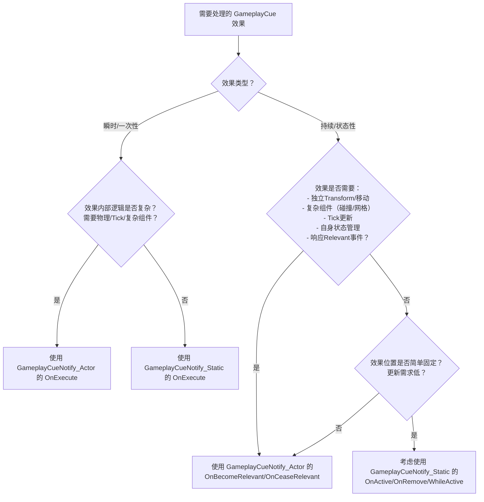

# UGameplayCueNotify_Static

在 UE5 的 Gameplay Ability System (GAS) 中，`UGameplayCueNotify_Static` 是处理 `GameplayCue` 视觉、听觉和粒子效果的核心静态类。`OnExecute` 和 `OnActive` (注意是 `OnActive`，不是 `OnActivate`) 是其最重要的两个事件处理函数，它们的主要区别在于**触发时机**和**预期的效果类型**：

### 🎯 核心区别

1.  **`OnExecute`**:
    *   **触发时机：** 当 `GameplayCue` 被触发为 **`Execute`** 类型时调用。这通常表示一个 **瞬时、一次性** 的效果。
    *   **预期效果：** 用于播放不需要持续存在、执行一次就结束的效果。例如：
        *   一个伤害数字弹出 (`Floating Damage Text`)
        *   一次击中时的火花特效 (`Hit Spark`)
        *   一次性的音效 (`Hit Sound`)
        *   一个短暂的角色闪白 (`Hit Flash`)
        *   消耗品使用的视觉/听觉反馈 (`Potion Use`)
    *   **行为：** `OnExecute` 函数执行后，`GameplayCueNotify_Static` 的实例（如果创建了）会很快被销毁（因为它只负责处理一个瞬时事件）。即使函数内部启动了有持续时间的粒子或声音，这些效果会独立播放完，但 `Cue` 对象本身的生命周期很短。
    *   **函数签名：** `bool OnExecute(AActor* MyTarget, const FGameplayCueParameters& Parameters)`

2.  **`OnActive`**:
    *   **触发时机：** 当 `GameplayCue` 被触发为 **`Add`** 类型时调用。这通常表示一个 **持续存在** 的效果**开始**了。
    *   **预期效果：** 用于初始化并播放需要在一段时间内持续存在的效果。例如：
        *   角色身上燃烧的火焰特效 (`Burning`)
        *   增益/减益光环 (`Buff Aura`, `Debuff Aura`)
        *   护盾激活时的能量罩 (`Shield Bubble`)
        *   持续恢复生命值的光效 (`Regeneration VFX/SFX`)
        *   一个长时间的状态图标 (`Status Icon`)
    *   **行为：** `OnActive` 调用后，`GameplayCueNotify_Static` 的实例会**保持活跃状态**（通常附加在目标 Actor 上），直到收到对应的 `Remove` 事件。它负责管理整个持续效果的视觉/听觉表现。
    *   **后续事件：** 一个以 `Add` 开始的持续 `GameplayCue`，在其生命周期中可能还会收到 `WhileActive` 事件（每帧或按需触发，用于更新效果，如根据剩余护盾值改变护罩强度）和最终的 `Remove` 事件（当效果结束时调用，用于清理资源）。
    *   **函数签名：** `bool OnActive(AActor* MyTarget, const FGameplayCueParameters& Parameters)`

### 📌 关键对比表

| 特性                 | `OnExecute`                              | `OnActive`                                  |
| :------------------- | :--------------------------------------- | :------------------------------------------ |
| **触发事件**         | `Execute`                                | `Add`                                       |
| **效果类型**         | 瞬时、一次性                             | 持续效果**的开始**                          |
| **生命周期**         | 调用后很快销毁                           | 保持活跃直到收到 `Remove` 事件              |
| **典型用途**         | 伤害数字、击中特效、短暂闪光、一次性音效 | 燃烧光环、护盾、状态图标、持续恢复特效/音效 |
| **后续事件**         | 无                                       | `WhileActive`, `Remove`                     |
| **是否创建持久实例** | 通常否（瞬时处理）                       | 是（用于管理持续效果）                      |

### 🧩 如何选择（使用情况）

选择使用 `OnExecute` 还是 `OnActive` 取决于你想要触发的 `GameplayCue` 本身在逻辑上代表什么类型的效果：

1.  **使用 `OnExecute` 当：**
    *   你需要的效果是**瞬间发生并结束**的。
    *   效果不需要根据时间或状态进行持续的更新（比如位置调整、强度变化）。
    *   例如：当一次攻击命中时播放一个火花和“铿锵”声，或者一个治疗药水被喝下时播放一个闪光和“咕咚”声。

2.  **使用 `OnActive` 当：**
    *   你需要的效果代表一个**持续的状态**（Buff、Debuff、环境效果）。
    *   效果需要**在一段时间内存在**，并且可能在存在期间需要更新（通过 `WhileActive`）。
    *   效果需要在状态结束时被**明确地移除或清理**（通过 `OnRemove`）。
    *   例如：给角色施加一个持续10秒的“加速”Buff（显示奔跑轨迹粒子），或者角色站在岩浆区域中持续受到伤害（显示脚部燃烧特效）。

### 🔧 技术流程简述

1.  **定义 GameplayCue 标签：** 在项目中定义 `GameplayCue` 标签 (如 `GameplayCue.Damage`， `GameplayCue.Burning`)。
2.  **创建 GameplayCueNotify_Static：** 为特定的 `GameplayCue` 标签创建蓝图或C++类继承自 `UGameplayCueNotify_Static`。
3.  **实现事件：**
    *   在对应的 `GameplayCueNotify_Static` 类中重写并实现 `OnExecute` (针对瞬时 `Execute` 事件) 或 `OnActive`/`WhileActive`/`OnRemove` (针对持续 `Add`/`WhileActive`/`Remove` 事件) 函数。在这些函数里编写生成粒子、播放声音、附加Actor等逻辑。
4.  **触发 GameplayCue：**
    *   **瞬时 (`Execute`)：** 在 `GameplayAbility` 或 `GameplayEffect` 中，调用 `UAbilitySystemComponent::ExecuteGameplayCue` 或 `UAbilitySystemComponent::ExecuteGameplayCueLocal` (带 `GameplayCueTag` 和参数)。这会调用匹配的 `GameplayCueNotify_Static` 的 `OnExecute`。
    *   **持续 (`Add`/`Remove`)：**
        *   **开始 (`Add`):** 通常在应用一个带有 `GameplayCue` 标签的持续型 `GameplayEffect` 时，GAS 会自动触发 `Add` 事件（如果该Effect被成功应用），调用匹配 `GameplayCueNotify_Static` 的 `OnActive`。你也可以手动调用 `UAbilitySystemComponent::AddGameplayCue`。
        *   **结束 (`Remove`):** 当带有 `GameplayCue` 标签的持续型 `GameplayEffect` 被移除（到期、手动移除、被其他效果移除）时，GAS 会自动触发 `Remove` 事件，调用 `OnRemove`。也可以手动调用 `UAbilitySystemComponent::RemoveGameplayCue`。
    *   **更新 (`WhileActive`):** 可以在 `GameplayCueNotify_Static` 的 `WhileActive` 事件中编写逻辑（如每帧更新粒子位置到骨骼插槽），或通过手动调用 `UAbilitySystemComponent::InvokeRepeatingEvent` 等方式触发（较少用自动触发）。

### 📣 总结

*   **`OnExecute` = "砰！" (一下就没了)** - 处理瞬间的视觉/听觉反馈。
*   **`OnActive` = "嗡~~~" (开始持续响)** - 处理持续效果**的初始化**，并标志着效果对象开始存活，等待后续的 `WhileActive` 更新和 `Remove` 清理。

选择正确的触发事件 (`Execute` vs `Add`) 并实现对应的处理函数 (`OnExecute` vs `OnActive`)，是确保 `GameplayCue` 视觉/听觉表现与底层游戏逻辑（`GameplayAbility`/`GameplayEffect`）正确同步的关键💡。

#  `GameplayCueNotify_Actor`与 `GameplayCueNotify_Static`

我们来深入探讨 `GameplayCueNotify_Actor` 的事件选择以及与 `GameplayCueNotify_Static` 的核心区别和选用策略。理解这两者的差异是构建高效、灵活 GAS 视觉效果的关键。

---

### 🧩 `GameplayCueNotify_Actor` 的事件：`OnBecomeRelevant`, `OnCeaseRelevant`, `OnExecute`

`GameplayCueNotify_Actor` 的核心特点是它**本身是一个 `Actor`**。这意味着：

1.  **拥有完整生命周期：** 它可以存在于关卡中，有 `Tick`，可以附加组件，有变换信息。
2.  **更复杂的状态管理：** 适合需要自身状态、长时间存在、动态交互或复杂逻辑的效果。
3.  **响应范围事件：** `OnBecomeRelevant`/`OnCeaseRelevant` 是其独特优势。

以下是各事件的含义和选用场景：

1.  **`OnExecute`：**
    *   **含义：** 与 `Static` 版本的 `OnExecute` **概念相同**。处理一次性的、瞬时的 `Execute` 类型 `GameplayCue` 事件。
    *   **触发：** 当关联的 `GameplayCueTag` 被 `Execute` 触发时调用。
    *   **使用场景：**
        *   你**需要**一个 `Actor` 来管理这个瞬时效果（例如，效果需要复杂的物理模拟、需要与其他 Actor 持续交互、需要播放一段有状态变化的动画序列）。
        *   效果虽然是瞬时的，但**内部逻辑复杂**，需要 `Tick` 或状态机来管理其短暂的存活期（例如，一个会弹跳几次然后消失的榴弹爆炸碎片效果）。
        *   **通常较少用 `OnExecute`：** 对于纯瞬时效果（火花、音效），`Static` 版本通常更轻量高效。`Actor` 版本的 `OnExecute` 主要用于需要 `Actor` 特性的**复杂瞬时效果**。

2.  **`OnBecomeRelevant`：**
    *   **含义：** **核心事件**。当 `GameplayCueNotify_Actor` **首次变得相关**时调用。这通常发生在：
        *   一个带有其关联 `GameplayCueTag` 的持续型 `GameplayEffect` **被成功应用**到目标时（触发 `Add` 事件）。
        *   **或者**，该 `Actor` 被手动生成并关联到一个目标（`AttachToActor` 等），且其关联的 `GameplayCueTag` 在目标上被标记为需要表现时。
    *   **触发：** 本质上对应持续效果的 **`Add` 事件**，但更强调 `Actor` 本身开始参与游戏逻辑（变得相关）。
    *   **使用场景：** **这是 `Actor` 版本处理持续效果开始的主要入口点。**
        *   初始化需要长时间存在的复杂效果（燃烧、光环、护盾）。
        *   生成并附加粒子系统组件、音频组件、静态网格组件等。
        *   设置初始状态，启动定时器，绑定事件委托。
        *   执行需要 `Actor` 位置、旋转或与其他场景对象交互的逻辑。
        *   *例如：* 生成一个火焰粒子特效 Actor 并附加到角色骨骼上；生成一个环绕角色的能量盾网格体；播放一个循环的增益音效。

3.  **`OnCeaseRelevant`：**
    *   **含义：** 当 `GameplayCueNotify_Actor` **不再相关**时调用。这通常发生在：
        *   导致其关联 `GameplayCueTag` 被激活的持续型 `GameplayEffect` **被移除**时（触发 `Remove` 事件）。
        *   **或者**，该 `Actor` 与其目标失去关联（目标死亡、离开范围等），不再需要表现其效果。
    *   **触发：** 本质上对应持续效果的 **`Remove` 事件**，表示 `Actor` 的生命周期即将结束（停止相关）。
    *   **使用场景：** **这是 `Actor` 版本处理持续效果结束和清理的主要入口点。**
        *   停止粒子发射、淡出或销毁粒子组件。
        *   停止循环音效、播放结束音效。
        *   销毁附加的网格体组件。
        *   清除定时器，解绑事件委托。
        *   执行任何必要的清理逻辑（如移除施加的物理力）。
        *   通常最后会调用 `Destroy()` 销毁自身 Actor。
        *   *例如：* 让火焰粒子系统停止发射并开始淡出；停止护盾能量音效并播放护盾破裂音效；销毁环绕角色的光环网格体。

### 🔄 `GameplayCueNotify_Actor` 的事件流程（持续效果）

1.  **开始 (`Add` / 相关开始):**
    *   目标获得带有 `GameplayCueTag` 的 `GameplayEffect` (或手动触发 `AddGameplayCue`)。
    *   GAS 查找或生成关联的 `GameplayCueNotify_Actor` (通常通过 `SpawnActor` 或对象池)。
    *   **`OnBecomeRelevant`** 被调用。在此初始化效果 Actor，附加组件等。
    *   （可选）`Tick` 或 `WhileActive` 逻辑开始运行（如果需要持续更新）。
2.  **持续期间 (`WhileActive` / `Tick`):**
    *   `Actor` 持续存在，可以利用 `Tick` 函数进行每帧更新。
    *   （可选）可以通过 `UAbilitySystemComponent::InvokeRepeatingEvent` 或其他机制触发自定义的 `WhileActive` 逻辑（较少自动触发标准的 `WhileActive` 事件到 `Actor` 通知）。
    *   *主要更新逻辑通常在 `Tick` 中处理。*
3.  **结束 (`Remove` / 相关结束):**
    *   导致效果的 `GameplayEffect` 被移除（到期、取消等）或手动调用 `RemoveGameplayCue`。
    *   **`OnCeaseRelevant`** 被调用。在此执行清理逻辑（停止效果、淡出、销毁组件）。
    *   `Actor` 通常会调用 `Destroy()` 销毁自身。

---

### 🆚 `GameplayCueNotify_Static` vs `GameplayCueNotify_Actor`：如何选择？

选择的关键在于**效果的复杂度**、**生命周期管理需求**和**性能考量**：

| 特性                                     | `GameplayCueNotify_Static`                                   | `GameplayCueNotify_Actor`                                    | **选用建议**                                                 |
| :--------------------------------------- | :----------------------------------------------------------- | :----------------------------------------------------------- | :----------------------------------------------------------- |
| **本质**                                 | `UObject` (轻量级)                                           | `AActor` (重量级，有 Transform, Tick, 组件等)                |                                                              |
| **实例化**                               | 通常按需创建短暂实例处理事件后销毁，或使用共享实例池。       | 按需 `SpawnActor` 生成，有明确的生命周期 (`BeginPlay`/`EndPlay`/`Destroy`)。 |                                                              |
| **生命周期管理**                         | 简单，事件驱动，内部无状态（或短暂状态）。                   | 复杂，自身是独立 Actor，可维护状态，有完整生命周期事件。     | **需要状态/复杂交互 -> Actor**                               |
| **位置/旋转/缩放**                       | 依赖目标 Actor 或传入参数。创建效果时指定位置。              | 自身有 Transform，可以自由移动、旋转，可附加到骨骼或插槽，更容易做动态变换。 | **效果需要独立移动/复杂变换 -> Actor**                       |
| **`Tick` 需求**                          | **没有** `Tick`。更新逻辑需通过 `WhileActive` 事件或外部驱动。 | **有** `Tick`。适合需要每帧更新位置、检测条件、进行物理模拟的效果。 | **需要每帧精确控制 -> Actor**                                |
| **组件管理**                             | 能生成粒子/声音，但管理较简单（通常播放完自动销毁）。        | 能添加和管理各种 `UActorComponent` (粒子、声音、网格、碰撞体、移动组件等)，更灵活强大。 | **需要复杂组件组合/碰撞/物理 -> Actor**                      |
| **`OnBecomeRelevant`/`OnCeaseRelevant`** | 无                                                           | **核心优势。** 完美匹配持续效果的 `Add`/`Remove` 语义，提供清晰的开始/结束点。 | **处理复杂持续效果的首选机制 -> Actor**                      |
| **性能开销**                             | **较低。** 实例短暂，无 Tick，适合大量瞬时效果。             | **较高。** 生成/销毁 Actor 开销大，Tick 消耗 CPU。           | **性能敏感/大量简单效果 -> Static**                          |
| **典型用例**                             | *瞬时：* 伤害数字、击中火花、短暂闪光、一次性音效。 *持续（简单）：* 静态位置的光环、固定图标（若无需复杂更新）。 | *瞬时（复杂）：* 需要物理模拟的爆炸碎片、会滚动的治疗包。 *持续（复杂）：* 跟随骨骼移动的火焰、可交互的能量护盾（有碰撞）、需要检测周围单位的治疗光环、动态变化的腐蚀效果。 | **简单用 Static，复杂用 Actor。持续效果优先考虑 Actor 的 Relevant 事件。** |

### 📌 选用决策流程图

### 📣 总结与最佳实践

1.  **`GameplayCueNotify_Static`：**
    *   **首选** 用于**简单、瞬时**的效果（`OnExecute`）。
    *   **可考虑** 用于**非常简单的持续效果**（`OnActive`/`WhileActive`/`OnRemove`），尤其是那些位置固定、不需要每帧复杂更新、没有交互的效果（如一个简单的角色头顶状态图标VFX）。**优先评估是否真的不需要Actor。**
    *   **优势：** 轻量、高效、无Tick开销。
2.  **`GameplayCueNotify_Actor`：**
    *   **首选** 用于**所有复杂的持续效果**（`OnBecomeRelevant`/`OnCeaseRelevant`）。这是处理这类效果最自然、功能最强大的方式。
    *   **选用** 用于**内部逻辑复杂的瞬时效果**（`OnExecute`），这些效果需要Actor的能力（物理、复杂动画、Tick管理其短暂生命周期）。
    *   **核心价值：** `OnBecomeRelevant`/`OnCeaseRelevant` 提供完美的持续效果生命周期钩子，以及作为 `Actor` 带来的完整功能集（Transform、组件、Tick、碰撞、物理等）。
3.  **性能是关键：**
    *   在移动端或需要处理大量 `GameplayCue` 的场景，**严格限制** `GameplayCueNotify_Actor` 的使用。滥用会导致性能急剧下降。
    *   优先使用 `Static` 版本处理大量、频繁触发的简单效果（如伤害数字、击中反馈）。
    *   对于 `Actor` 版本，考虑使用对象池 (`Object Pooling`) 来管理其生成和销毁，减少开销。

**简单来说：**

*   看到 `Execute` 事件 -> 优先想 `Static.OnExecute` (除非效果**非常**复杂)。
*   看到 `Add`/`Remove` 事件 -> **优先考虑 `Actor.OnBecomeRelevant`/`OnCeaseRelevant`** (除非效果**极其**简单且固定)。
*   `Static.WhileActive` 适合简单更新，`Actor.Tick` 适合复杂更新。

理解这两类通知及其事件的区别，能让你在 GAS 中更精准、高效地实现丰富多样的游戏视觉效果。💡